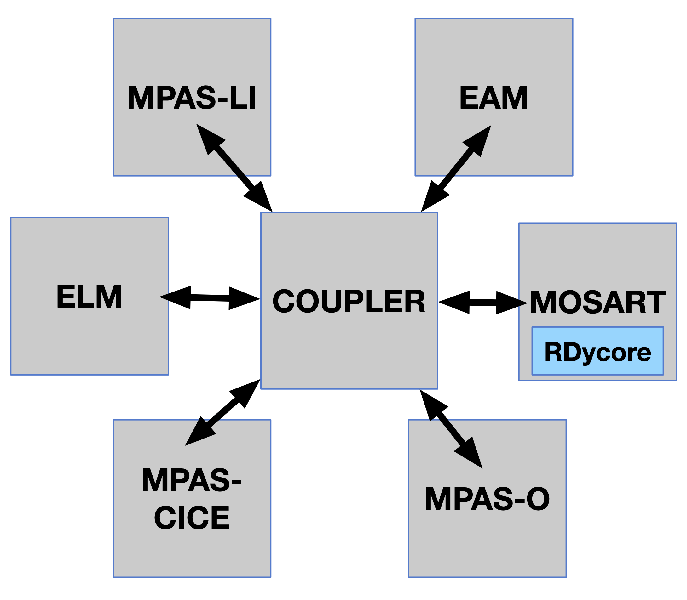

# E3SM-RDycore

The coupled E3SM-RDycore is developed within a fork of the E3SM repository under the RDycore's Github account at [https://github.com/rdycore/e3sm](https://github.com/rdycore/e3sm). The coupled model is developed in a branch within the forked repository and the current branch is named `rdycore/mosart-rdycore/8b4c2d5df3-2024-04-05`. The `8b4c2d5df3` corresponds to the Git hash of the commit on the E3SM master branch from which the current E3SM-RDycore development branch started and `2024-04-05` corresponds to the date of that starting commit.

```text
# From E3SM repo
>git show 8b4c2d5df3
commit 8b4c2d5df3f0a53a2ea49bc0c63c2c7f07bcadd4
Merge: 3b09ee8c5c 686b5c1689
Author: James Foucar <jgfouca@sandia.gov>
Date:   Fri Apr 5 09:05:36 2024 -0600

 Merge branch 'jgfouca/rm_gnu9' into master (PR #6328)

 Remove gnu9 1-off

 This was a 1-off for mappy that needed two gnu toolchains. Now that we
 have 11.2, we don't need this.

 [BFB]

(END)
```

The E3SM-RDycore development branch is infrequently rebased on E3SM's master. After a rebase, the E3SM-RDycore development branch would named such that the new name correctly represents the starting commit hash and the commit date. The RDycore has been added in E3SM as a submodule at
`externals/rdycore`. In the current model coupling, RDycore is part of the MOSART as shown below.



The following E3SM-RDycore case is supported:
1. [Hurricane Havey flooding](harvey-flooding/e3sm_harvey.md)