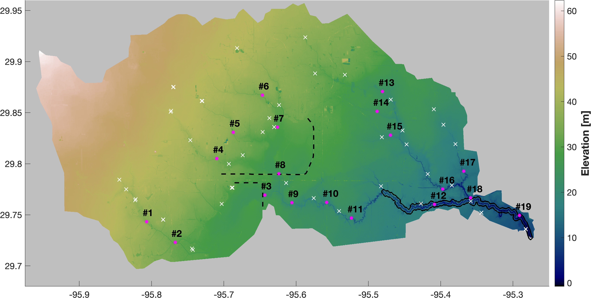

# Overview

The RDycore mesh (`Turning_30m_with_z.updated.with_sidesets.exo`) for the
Houston Harvey flooding problem is in the Exodus II format and consist of
2,926,532 grid cells. The mesh also includes a single edge sideset that
is includes 13 (`=num_side_ss1`) edges, which are identified by `elem_ss1` and
`side_ss1` in the mesh file.

The topography based on the 30m DEM dataset for the study domain is shown above.
The white crosses denote the locations of high water mark measurements from USGS,
and the red asterisks are the USGS gauges with the gauge number. The black dashed
lines represent two dams used as flood control reservoirs: Addicks (the upper one)
and Barker (the lower one). The black solid line shows the extent of major channels.

The following two RDycore examples for the Hurricane Harvey flooding showcase
different capabilties of the RDycore driver:

1. [`critical-outflow-bc`](critical-outflow-bc/harvey-critical-outflow-bc.md):
    - Uses spatially-distributed and temporally-varying rainfall dataset.
    - A critical outflow boundary condition is applied on the 13 edges.

2. [`ocean-bc`](ocean-bc/harvey-ocean-bc.md):
    - Uses a spatially-averaged and temporally-varying rainfall dataset.
    - A time-varying, but spatially-homogeneous ocean water height boundary
      condition is applied on the 13 edges.
