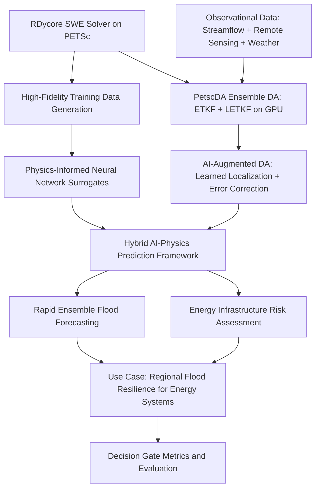

# Genesis Mission FOA Response Plan
## DE-FOA-0003612 — Topic 15-B: Water and Energy

---

## 1. Executive Summary

This plan outlines a strategy for responding to the DOE Genesis Mission FOA
(DE-FOA-0003612) under **Topic 15: Predicting U.S. Water for Energy**, **Focus
Area B: Water and Energy**. The proposal will leverage **RDycore** — a
performance-portable, GPU-capable river/compound flooding model built on
**PETSc** and designed for integration with DOE's **E3SM** — to develop
AI-enhanced flood prediction capabilities that improve water availability
forecasting for energy infrastructure resilience.

### Key FOA Facts

| Item | Detail |
|------|--------|
| **FOA Number** | DE-FOA-0003612 |
| **Title** | The Genesis Mission: Transforming Science and Energy with AI |
| **Target Topic** | 15 - Predicting U.S. Water for Energy |
| **Target Focus Area** | B - Water and Energy (BER) |
| **Phase** | Phase I (small team) |
| **Budget** | $500,000 - $750,000 |
| **Duration** | 9 months (July 1, 2026 - March 31, 2027) |
| **Application Deadline** | April 28, 2026, 11:59 PM Eastern |
| **Go/No-Go Review** | 6 months into Phase I |
| **Lead Applicant Type** | DOE/NNSA National Laboratory |

---

## 2. Focus Area B Requirements Analysis

The FOA states that Focus Area B (Water and Energy) seeks:

> The predictive understanding of surface and groundwater is crucial for
> ensuring sufficient water for energy production and for protecting energy
> infrastructure from floods. The core scientific objective is to use advanced
> AI techniques to create a coupled surface-groundwater model that improves
> hydrologic process understanding and informs prediction of water availability.

### Specific Topics of Interest

1. **Integrative models** that utilize data of varying levels of complexity
   including multi-source observational data and high-resolution model outputs
2. **Hierarchy of models** and multi-modeling capabilities ranging from
   process-based models to Foundation models
3. **Transferable, hybrid modeling capabilities** so that advances in one
   region can be translated to another
4. **Robust model evaluation capabilities**

### Mandatory Use Case Requirement

> The applications to this research area must incorporate use cases to develop
> and test a new integrative framework focused on **regional energy needs and
> flood resilience**.

---

## 3. Proposal Strategy: AI-Enhanced RDycore for Flood-Resilient Energy Systems

### 3.1 Vision Statement

Develop an AI-augmented compound flooding prediction framework built on RDycore
and PETSc that:

1. Creates **physics-informed AI surrogate models** trained on RDycore's
   shallow water equation (SWE) solver to enable rapid flood scenario
   evaluation
2. Integrates **multi-source observational data** (streamflow gauges, remote
   sensing, weather data) with high-fidelity RDycore simulations through
   AI-driven data assimilation
3. Demonstrates **transferable hybrid modeling** by coupling AI emulators with
   process-based RDycore simulations across different regional watersheds
4. Delivers a **use case focused on flood resilience for energy
   infrastructure** (e.g., power plants, substations, transmission corridors
   in flood-prone regions)

### 3.2 Why AI Provides an Advantage

RDycore solves the 2D shallow water equations using finite volume methods on
unstructured meshes with PETSc. While highly accurate, full-resolution
simulations are computationally expensive, especially for:

- **Ensemble flood forecasting** requiring hundreds of scenario runs
- **Real-time flood warning** for energy infrastructure protection
- **Seasonal-to-annual water availability** assessments requiring many
  forward simulations
- **Uncertainty quantification** across parameter spaces

AI surrogates trained on RDycore simulation data can provide **orders of
magnitude speedup** while preserving physics-based accuracy, enabling
capabilities that are currently computationally infeasible.

### 3.3 Technical Approach



#### Component 1: Training Data Generation with RDycore

- Run RDycore on GPU-accelerated HPC systems across a matrix of:
  - Watershed geometries (multiple regional domains)
  - Forcing scenarios (precipitation, boundary conditions)
  - Parameter variations (Manning's n, bed elevation perturbations)
  - Initial conditions (antecedent soil moisture proxies)
- Generate a curated, AI-ready dataset of SWE solutions with metadata

#### Component 2: Physics-Informed AI Surrogate Development

- Train neural network surrogates that respect conservation laws inherent in
  the SWE (mass conservation, momentum balance)
- Explore architectures including:
  - **Graph Neural Networks (GNNs)** that naturally map to RDycore's
    unstructured mesh topology
  - **Fourier Neural Operators (FNOs)** for learning solution operators
  - **Physics-Informed Neural Networks (PINNs)** with SWE residual losses
- Leverage PETSc's data structures and DMPlex mesh representation for
  seamless data pipeline between solver and AI

#### Component 3: AI-Enhanced Data Assimilation (leveraging PETSc PetscDA + TSAdjoint + TAO)

- **Ensemble DA Baseline (PetscDA)**: PETSc now includes a dedicated
  **`PetscDA` data assimilation object** (in the `petsc_gem` branch) with
  production-quality implementations of:
  - **ETKF** (Ensemble Transform Kalman Filter) — [`PETSCDAETKF`](../petsc_gem/src/ml/da/impls/ensemble/etkf/etkfilter.c)
  - **LETKF** (Local Ensemble Transform Kalman Filter) — [`PETSCDALETKF`](../petsc_gem/src/ml/da/impls/ensemble/letkf/letkfilter.c)
    with **GPU-accelerated batched eigendecomposition** via Kokkos
    (CUDA/HIP/SYCL) — [`letkf_local_anal.kokkos.cxx`](../petsc_gem/src/ml/da/impls/ensemble/letkf/kokkos/letkf_local_anal.kokkos.cxx)
  - Localization support for scalable analysis on large grids
  - Working **shallow water equation tutorials** including 1D dam-break
    ([`ex3.c`](../petsc_gem/src/ml/da/tutorials/ex3.c)) and 2D wave
    propagation ([`ex4.c`](../petsc_gem/src/ml/da/tutorials/ex4.c))
    demonstrating LETKF with SWE — the exact physics RDycore solves
- **Variational DA Baseline (TSAdjoint + TAO)**: PETSc's TSAdjoint framework
  computes exact gradients of cost functions w.r.t. initial conditions and
  parameters. Working examples include
  [`spectraladjointassimilation.c`](../petsc_gem/src/tao/unconstrained/tutorials/spectraladjointassimilation.c)
  and [`ex20opt_ic.c`](../petsc_gem/src/ts/tutorials/ex20opt_ic.c)
- **AI acceleration**: Train neural network correction operators that
  augment PetscDA ensemble analysis — learning to correct ensemble spread
  deficiencies and model error using the ETKF/LETKF analysis increments
  as training signal
- **Hybrid ensemble-variational**: Combine PetscDA ensemble covariances
  with TSAdjoint-computed gradients for hybrid EnVar assimilation
- Use PETSc's TSTrajectory checkpointing for efficient forward/adjoint
  solution storage and replay

#### Component 4: Use Case — Flood Resilience for Energy Infrastructure

- Select a regional watershed with significant energy infrastructure
  (e.g., Houston/Gulf Coast region — leveraging existing RDycore Houston1km
  mesh and data already in the codebase)
- Demonstrate rapid ensemble flood forecasting for energy facility protection
- Quantify AI advantage: speedup, accuracy retention, and decision-relevant
  lead time improvements

---

## 4. Team Composition Requirements

The FOA requires Phase I teams to include institutions from **at least two** of:
1. DOE/NNSA National Laboratory or Scientific User Facility
2. Industry
3. Institute of Higher Education (IHE) / Non-profit / Other

### Recommended Team Structure

| Role | Institution Type | Suggested Responsibilities |
|------|-----------------|---------------------------|
| **Lead PI** | DOE National Lab | Overall project leadership, RDycore development, HPC simulation, AI surrogate development |
| **Co-PI 1** | University (IHE) | AI/ML methodology (PINNs, GNNs, FNOs), theoretical foundations, graduate student involvement |
| **Co-PI 2** | Industry Partner | Energy infrastructure use case data, operational flood risk perspective, path to deployment |
| **Co-PI 3** (optional) | Second DOE Lab or University | Hydrology/data assimilation expertise, observational data access |

### Key Expertise Needed

- **Computational hydrology / shallow water equations** — RDycore team
- **PETSc / HPC software engineering** — RDycore/PETSc developers
- **PetscDA / ensemble data assimilation** — PetscDA developer (ETKF/LETKF)
- **Physics-informed machine learning** — AI/ML researchers
- **Flood risk assessment for energy systems** — domain expert
- **Observational hydrology / data assimilation** — data scientist
- **GPU computing / performance portability** — HPC engineer (Kokkos)

### Partner Identification Actions

- [ ] Identify 1-2 university partners with AI/ML for scientific computing
  expertise (e.g., groups working on PINNs, neural operators, or GNNs for
  PDEs)
- [ ] Identify an industry partner in the energy sector with flood risk
  concerns (e.g., utility company, energy infrastructure operator, or
  AI-for-energy startup)
- [ ] Secure Letters of Commitment from all partner institutions
- [ ] If applicable, obtain written authorization from cognizant DOE
  Contracting Officer for lab participation

---

## 5. Project Narrative Structure (5-page limit)

The FOA strongly encourages the following organization:

### Page 1: Background/Introduction (~1 page)

**Key messages to convey:**
- Compound flooding threatens U.S. energy infrastructure; current prediction
  tools are too slow for real-time ensemble forecasting
- RDycore is a DOE-funded, GPU-capable, PETSc-based SWE solver designed for
  E3SM — representing years of DOE investment in process-based modeling
- AI can bridge the gap between high-fidelity simulation and operational
  flood prediction needs
- This project will create a hybrid AI-physics framework that preserves
  RDycore's physical fidelity while enabling rapid scenario evaluation
- **Buy America statement**: This project does not involve construction,
  alteration, maintenance, or repair of public infrastructure

### Page 1.5: Project Objectives (~0.5 page)

**Objectives aligned with Focus Area B:**
1. Develop physics-informed AI surrogates for RDycore's SWE solver that
   achieve >100x speedup with <5% error relative to full simulations
2. Create an AI data assimilation framework that integrates multi-source
   observational data with RDycore predictions
3. Demonstrate transferability of the hybrid framework across at least two
   regional watersheds
4. Deliver a use case demonstrating rapid ensemble flood forecasting for
   energy infrastructure resilience
5. Define scaling metrics showing AI advantage increases with data/compute

### Pages 2-3.5: Proposed Research and Methods (~1.5 pages)

**Task 1: High-Fidelity Training Data Generation (Months 1-3)**
- PI: Lab lead
- Generate RDycore simulation ensembles on GPU clusters
- Curate AI-ready datasets with standardized metadata
- Budget: ~25% of total

**Task 2: Physics-Informed AI Surrogate Development (Months 2-6)**
- PI: University partner
- Develop and train GNN/FNO/PINN architectures
- Validate against held-out RDycore simulations
- Budget: ~30% of total

**Task 3: PetscDA + AI Data Assimilation Integration (Months 3-7)**
- PI: Lab lead (PetscDA/RDycore integration) + university partner (AI augmentation)
- Couple RDycore with PetscDA LETKF for GPU-accelerated ensemble DA
- Develop AI-learned localization and error correction operators
- Integrate observational data streams (streamflow gauges, remote sensing)
- Budget: ~20% of total

**Task 4: Energy Infrastructure Flood Resilience Use Case (Months 5-9)**
- PI: Industry partner + Lab lead
- Apply framework to Houston or similar energy-critical region
- Demonstrate ensemble forecasting capability
- Quantify AI advantage metrics
- Budget: ~20% of total

**Project Management and Coordination (Throughout)**
- Budget: ~5% of total

### Pages 3.5-4.5: Milestones (~1 page)

| Month | Milestone | Go/No-Go Criterion |
|-------|-----------|-------------------|
| 1 | Simulation matrix defined; RDycore runs initiated | N/A |
| 2 | First training dataset generated (>1000 simulations) | Dataset quality metrics met |
| 3 | **Go/No-Go**: Initial AI surrogate trained and validated | Surrogate achieves <10% relative error on test set |
| 4 | AI surrogate refined; PetscDA LETKF coupled with RDycore | Surrogate speedup >50x; LETKF analysis reduces RMSE |
| 5 | Multi-region transferability test initiated | Framework runs on second watershed |
| 6 | **6-Month Go/No-Go Review**: Full framework demonstrated | Surrogate <5% error, >100x speedup, data assimilation functional |
| 7 | Energy infrastructure use case initiated | Use case domain and data secured |
| 8 | Ensemble forecasting demonstration | >100 ensemble members in <1 hour |
| 9 | Final evaluation and Phase II planning | All decision gate metrics met |

### Pages 4.5-5: Data Sources and Models + Decision Gate Metrics (~1 page)

**Data Sources:**
- RDycore-generated simulation data (primary training data)
- USGS streamflow gauge data (validation/assimilation)
- NOAA precipitation and weather data (forcing)
- NHDPlus/NWM watershed geometry data
- Energy infrastructure location data (DOE/EIA)
- Existing RDycore test cases (Houston1km mesh already in codebase)

**AI Models/Frameworks:**
- PyTorch/JAX for neural network training
- PETSc for solver infrastructure and data management
- **PetscDA** (ETKF/LETKF) for GPU-accelerated ensemble data assimilation
- PETSc TSAdjoint/TAO for variational DA and parameter optimization
- RDycore for high-fidelity SWE solutions
- E3SM for broader Earth system context

**Decision Gate Metrics (for 6-month go/no-go):**
1. **Speedup**: AI surrogate achieves >100x wall-clock speedup vs. full
   RDycore simulation
2. **Accuracy**: <5% relative L2 error in water depth predictions across
   test scenarios
3. **Conservation**: AI surrogate preserves mass conservation to within 1%
4. **Transferability**: Framework successfully applied to at least 2
   distinct watersheds
5. **Scaling behavior**: Performance improves monotonically with additional
   training data (demonstrating AI advantage trajectory)

---

## 6. Required Application Components Checklist

### Forms and Documents

- [ ] **SF-424 (R&R)** — Cover page with all required fields
- [ ] **Research and Related Other Project Information** — Questions 1-6
- [ ] **Project Summary/Abstract** (1 page max) — Vision, AI advantage, team
- [ ] **DOE Title Page** — Project title, lead institution, PI info, RFA
  number, focus area "15-B Predicting U.S. Water for Energy | Water and
  Energy", senior/key personnel table, summary budget table
- [ ] **Project Narrative** (5 pages max) — As structured above
- [ ] **Appendix 1: Bibliography and References Cited** (no page limit)
- [ ] **Appendix 2: Facilities and Other Resources** (0.5 page max) —
  HPC resources, GPU clusters, data storage
- [ ] **Appendix 3: Equipment** (0.5 page max)
- [ ] **Appendix 4: Data Management and Sharing Plan** — NOT required at
  application; required at award negotiation
- [ ] **Appendix 5: Synergistic Activities** (optional, 1 page per person)
- [ ] **Appendix 6: Transparency of Foreign Connections** — Lab exempt;
  required for non-lab partners
- [ ] **Appendix 7: Other Attachments** — Letters of Commitment from all
  partners, Letters of Collaboration/Access
- [ ] **Research and Related Senior/Key Person Profile (Expanded)** —
  Biographical sketches (SciENcv format) and Current & Pending Support
  for all senior/key personnel
- [ ] **Research and Related Budget** — Single 9-month period
  (July 1, 2026 - March 31, 2027)
- [ ] **Budget Justification** — Detailed justification for all costs
- [ ] **Identification of Merit Reviewer Conflicts** — Excel template,
  attach to Field 12
- [ ] **Excel template** for focus area, senior/key personnel, partner
  institutions, and budget — attach to Field 12

### Administrative Actions

- [ ] Ensure SAM.gov registration is current
- [ ] Ensure Grants.gov registration and AOR role are active
- [ ] Obtain DOE Contracting Officer authorization for lab participation
- [ ] Register in PAMS after submission
- [ ] Register with FedConnect
- [ ] Register with FSRS

---

## 7. Budget Framework (Phase I: $500K-$750K over 9 months)

### Suggested Budget Allocation

| Category | Estimated % | Notes |
|----------|------------|-------|
| Senior/Key Personnel (Lab) | 25-30% | PI + 1-2 co-PIs at lab |
| Other Personnel (Lab) | 10-15% | Postdoc, research staff |
| University Subaward(s) | 20-25% | AI/ML co-PI + graduate student |
| Industry Subaward | 5-10% | Up to 20% of total for industry |
| Travel | 3-5% | Genesis Mission meetings (up to 2), partner coordination |
| Computing/ADP Services | 5-10% | Cloud computing, GPU allocations if needed |
| Materials and Supplies | 2-3% | Software licenses, data storage |
| Indirect Costs | Per negotiated rate | Lab and subaward rates |

### Budget Notes

- Phase I budget period: single period, July 1, 2026 - March 31, 2027
- Industry partner funding limited to up to 20% of total requested budget
- For-profit entities require 20% cost share for R&D activities
- DOE Labs are exempt from cost sharing
- Include travel for up to 2 Genesis Mission annual meetings
- Computing costs for GPU-accelerated RDycore runs and AI training

---

## 8. Review Criteria Alignment

The FOA lists review criteria in descending order of importance:

### Criterion 1: Scientific and/or Technical Merit and Impact (Highest Weight)

**How we address it:**
- Novel integration of physics-informed AI with a production-quality DOE
  SWE solver (RDycore)
- Clear AI advantage: enabling ensemble flood forecasting that is currently
  computationally infeasible
- Direct impact on water-energy nexus — protecting energy infrastructure
  from flooding
- Builds on years of DOE investment in RDycore, PETSc, and E3SM

### Criterion 2: Technical Approach, Methods, and Feasibility

**How we address it:**
- Well-defined task structure with clear milestones
- Proven base technology (RDycore is operational, GPU-capable, tested)
- **PetscDA already demonstrates ensemble DA on SWE** — the exact physics
  RDycore solves — with GPU-accelerated LETKF including working tutorials
  for 1D dam-break and 2D wave propagation
- AI methods (GNNs, FNOs, PINNs) are established but novel in this
  application context
- Risk mitigation: multiple AI architectures explored in parallel;
  PetscDA provides a working DA baseline even if AI augmentation
  underperforms
- Realistic 9-month timeline with quantitative go/no-go criteria

### Criterion 3: Team, Resources, and Management

**How we address it:**
- DOE Lab leadership with deep RDycore/PETSc expertise
- University partner(s) with AI/ML research strength
- Industry partner providing real-world energy infrastructure context
- Access to DOE HPC resources (GPU clusters)
- Clear role delineation across institutions

### Criterion 5: Budget and Cost-Effectiveness

**How we address it:**
- Leverages existing DOE-funded software (RDycore, PETSc, PetscDA, E3SM)
- PetscDA eliminates need to develop DA infrastructure from scratch
- Efficient use of GPU computing for simulation, DA, and AI training
- Reasonable budget within Phase I range
- Clear value proposition for Phase II scale-up

---

## 9. Phase II Vision (for narrative context)

While the Phase I application focuses on the 9-month proof of concept, the
narrative should hint at the Phase II vision (3 years, 3-5x budget):

- Scale the hybrid AI-physics framework to continental-scale watersheds
- Full integration with E3SM for coupled atmosphere-surface water prediction
- Operational deployment for real-time flood warning at energy facilities
- Extension to include groundwater coupling (completing the Focus Area B
  vision of "coupled surface-groundwater model")
- Foundation model development for hydrologic prediction
- Broader Genesis Mission integration — sharing models and data on the
  American Science Cloud (AmSC)

---

## 10. Timeline to Submission

| Date | Action |
|------|--------|
| **Now - April 1** | Identify and secure partner commitments; begin narrative drafting |
| **March 26** | Attend DOE informational webinar (3 PM Eastern) |
| **April 1-10** | Complete draft narrative; circulate to team for review |
| **April 10-15** | Prepare budget, biographical sketches, C&P support |
| **April 15-20** | Finalize all forms; internal review and approval |
| **April 20-25** | Submit through Grants.gov (allow buffer for technical issues) |
| **April 28** | **DEADLINE: 11:59 PM Eastern** |

---

## 11. Key Risks and Mitigations

| Risk | Mitigation |
|------|-----------|
| AI surrogates may not achieve target accuracy | Explore multiple architectures (GNN, FNO, PINN); define acceptable accuracy thresholds early |
| Insufficient training data diversity | Leverage RDycore's GPU capability for rapid ensemble generation; use Latin hypercube sampling for parameter space |
| Data assimilation integration too complex | **LOW RISK**: PetscDA already has working SWE+LETKF tutorials; integration with RDycore follows the same pattern |
| Industry partner difficult to secure quickly | Engage Genesis Mission Consortium partnership service; leverage existing DOE lab industry relationships |
| 9-month timeline too aggressive | Front-load data generation; PetscDA provides working DA baseline from month 1; parallelize AI development |
| Computing resource constraints | Leverage DOE lab allocations; PetscDA LETKF runs on GPU via Kokkos |
| Transferability across watersheds may be limited | Design AI architectures with mesh-invariant features (GNNs); include diverse training domains |

---

## 12. Connections to Genesis Mission Ecosystem

The proposal should emphasize integration with the broader Genesis Mission:

- **American Science Cloud (AmSC)**: Commit to hosting trained AI models,
  training datasets, and evaluation benchmarks on the platform
- **Transformational AI Models Consortium (ModCon)**: Contribute hydrologic
  AI models to the consortium's portfolio
- **Cross-topic synergies**: The hybrid AI-physics framework could benefit
  Topic 16 (Grid) for flood-related grid resilience, and Topic 21 (AFFECT)
  for fluid flow AI methods
- **Open science**: Commit to open-source release of AI models and training
  pipelines (RDycore and PETSc are already open source)
- **ASCR co-funding**: Emphasize advances in applied mathematics (physics-
  constrained learning), computer science (AI-HPC integration), and
  scientific software (PETSc/RDycore AI interfaces) to attract ASCR
  co-funding interest

---

## 13. PETSc Data Assimilation Capabilities for the Proposal

PETSc now has **two complementary data assimilation frameworks** that should
be central to the proposal's technical approach. Together they provide a
mature, GPU-accelerated, scalable foundation that **dramatically reduces
technical risk** and demonstrates immediate feasibility.

### 13.1 PetscDA — Ensemble Data Assimilation Object (NEW — in petsc_gem)

The `petsc_gem` branch of PETSc introduces a **first-class `PetscDA` object**
for data assimilation (header: [`petscda.h`](../petsc_gem/include/petscda.h),
implementation: [`petscda.c`](../petsc_gem/src/ml/da/interface/petscda.c)).
This is distinct from `DMDA` (structured grid DM) — `PetscDA` is a new
abstract object specifically for data assimilation algorithms.

#### API Overview

| Function | Purpose |
|----------|---------|
| [`PetscDACreate()`](../petsc_gem/src/ml/da/interface/petscda.c) | Create a DA object |
| `PetscDASetType()` | Select algorithm: `PETSCDAETKF` or `PETSCDALETKF` |
| `PetscDASetSizes()` | Set state and observation dimensions |
| `PetscDASetNDOF()` | Set degrees of freedom per grid point |
| `PetscDAEnsembleSetSize()` | Set number of ensemble members |
| `PetscDAEnsembleAnalysis()` | Perform analysis step given observations |
| `PetscDAEnsembleForecast()` | Advance all ensemble members via user callback |
| `PetscDAEnsembleInitialize()` | Initialize ensemble from mean + perturbations |
| `PetscDASetObsErrorVariance()` | Set observation error covariance |
| `PetscDALETKFSetLocalization()` | Set localization matrix for LETKF |

#### Implementations

1. **ETKF** ([`etkfilter.c`](../petsc_gem/src/ml/da/impls/ensemble/etkf/etkfilter.c)):
   Global Ensemble Transform Kalman Filter following Algorithm 6.4 of
   Asch, Bocquet, and Nodet (2016)

2. **LETKF** ([`letkfilter.c`](../petsc_gem/src/ml/da/impls/ensemble/letkf/letkfilter.c)):
   Local Ensemble Transform Kalman Filter with:
   - **Localization support** via sparse localization matrix Q
   - **GPU-accelerated batched eigendecomposition** via Kokkos
     ([`letkf_local_anal.kokkos.cxx`](../petsc_gem/src/ml/da/impls/ensemble/letkf/kokkos/letkf_local_anal.kokkos.cxx))
   - Support for **CUDA** (cusolverDn), **HIP** (rocsolver), and **SYCL** (oneMKL)
   - MPI-parallel with observation scattering and local work vectors
   - Persistent solver handles and workspace for efficiency

#### Tutorials — Already Demonstrating SWE + DA

| Tutorial | Description | Key Features |
|----------|-------------|--------------|
| [`ex1.c`](../petsc_gem/src/ml/da/tutorials/ex1.c) | ETKF on Lorenz-96 | Baseline chaotic system DA |
| [`ex2.c`](../petsc_gem/src/ml/da/tutorials/ex2.c) | LETKF on Lorenz-96 | Localized DA comparison |
| [`ex3.c`](../petsc_gem/src/ml/da/tutorials/ex3.c:1) | **1D SWE dam-break + LETKF** | Rusanov/MC flux, 2 DOF per point |
| [`ex4.c`](../petsc_gem/src/ml/da/tutorials/ex4.c:1) | **2D SWE wave + LETKF** | 3 DOF per point, Kokkos GPU, MPI parallel |

The `ex3` and `ex4` tutorials are **directly relevant** — they solve the
same shallow water equations that RDycore solves, using the same finite
volume approach, and demonstrate working LETKF data assimilation with
ensemble forecast/analysis cycles. The `ex4` tutorial even runs on GPU
via Kokkos with batched eigendecomposition.

#### Internal Data Structure

```c
struct _p_PetscDA {
  PetscInt obs_size;         /* Observation vector dimension p */
  PetscInt state_size;       /* State vector dimension n */
  Vec      obs_error_var;    /* Observation error variance */
  Mat      R;                /* Observation error covariance p x p */
  PetscInt ndof;             /* DOF per grid point */
};

typedef struct {
  PetscInt  size;      /* Number of ensemble members m */
  Mat       ensemble;  /* Ensemble matrix n x m */
  PetscReal inflation; /* Inflation factor */
} PetscDA_Ensemble;
```

### 13.2 TSAdjoint — Discrete Adjoint Framework

PETSc's `TSAdjoint` provides a complementary framework for computing
sensitivities of cost functions with respect to initial conditions and
parameters:

- **`TSAdjointSolve()`** — Solves the discrete adjoint problem for ODE/DAE
  systems, computing gradients w.r.t. initial conditions and parameters
- **`TSTrajectory`** — Saves forward solution trajectories with configurable
  checkpointing strategies for efficient adjoint computation
- **Second-order adjoints** — Supports Hessian-vector products

### 13.3 Existing Variational DA Examples

- **[`spectraladjointassimilation.c`](../petsc_gem/src/tao/unconstrained/tutorials/spectraladjointassimilation.c)**
  — Complete 4D-Var data assimilation: 1D advection-diffusion + TSAdjoint + TAO
- **[`ex20opt_ic.c`](../petsc_gem/src/ts/tutorials/ex20opt_ic.c)** — Optimizes
  initial conditions using TAO + TSAdjoint
- **[`ex20opt_p.c`](../petsc_gem/src/ts/tutorials/ex20opt_p.c)** — Optimizes
  model parameters using TAO + TSAdjoint with second-order adjoint

### 13.4 How to Leverage Both Frameworks in the Proposal

The proposal should highlight a **three-tier data assimilation strategy**:

1. **PetscDA ensemble DA for RDycore (immediate)**: Couple RDycore's SWE
   solver with PetscDA's LETKF to perform GPU-accelerated ensemble data
   assimilation. The existing SWE tutorials in PetscDA demonstrate this
   is feasible with minimal integration effort. RDycore provides the
   forecast model; PetscDA manages the ensemble analysis.

2. **AI-augmented ensemble DA**: Train neural networks to:
   - Learn adaptive localization functions (replacing hand-tuned Q matrices)
   - Correct ensemble spread deficiencies and model error
   - Predict optimal inflation factors
   - Use LETKF analysis increments as training signal

3. **Hybrid ensemble-variational (EnVar)**: Combine PetscDA ensemble
   covariances with TSAdjoint-computed gradients for hybrid 4D-EnVar
   assimilation, with AI learning to optimally blend the two.

4. **TAO for joint optimization**: Use TAO to jointly optimize
   physics-based parameters (Manning's n) and AI model weights.

### 13.5 Technical Advantage Statement (Updated)

> RDycore's foundation on PETSc provides immediate access to **two
> complementary data assimilation frameworks**: (1) the new `PetscDA`
> ensemble DA object with GPU-accelerated ETKF and LETKF implementations
> that have already been demonstrated on shallow water equations identical
> to those RDycore solves, and (2) the mature TSAdjoint/TAO variational
> DA framework. This combination is unique in the scientific computing
> landscape — no other flood modeling framework has both ensemble and
> variational DA built into its solver infrastructure with GPU
> acceleration. The integration of AI techniques with these existing
> capabilities represents a low-risk, high-reward approach that builds
> on proven infrastructure rather than developing DA from scratch.

---

## 14. RDycore Paper — Key Facts for the Proposal

Source: Bisht et al., "Development of a River Dynamical Core for E3SM to
Simulate Compound Flooding on Exascale-class Heterogeneous Supercomputers,"
submitted to Environmental Modelling & Software, Dec 2025.

### 14.1 Performance Numbers to Cite

| Metric | Value | Context |
|--------|-------|---------|
| Problem scale | 471M grid cells, 1.4B unknowns | Hurricane Harvey at 1.5m resolution |
| GPU speedup - Perlmutter | 6.6x-32.9x vs CPUs | NVIDIA A100, 5-320 nodes |
| GPU speedup - Frontier | 7.6x-41.9x vs CPUs | AMD MI250X, 5-320 nodes |
| E3SM-coupled SYPD on GPU | 0.90 Perlmutter, 0.63 Frontier | 15x-21x over CPU |
| Peak throughput | 449M cells/sec Perlmutter, 384M cells/sec Frontier | 320 GPU nodes |
| Harvey mesh | ~2.9M triangular cells, ~21m resolution | 5-day sim, 5 precip datasets |
| Malpasset dam break R² | 0.99 | Against observations at 9 gauges |

### 14.2 Technical Capabilities

- 2D conservative SWE with Roe approximate Riemann solver
- First-order FV on unstructured meshes (triangles, quads, mixed)
- Forward Euler + semi-implicit friction; also RK and SSP-RK via PETSc TS
- PETSc + libCEED for runtime CPU/GPU selection without recompilation
- DMPlex mesh management, ParMETIS domain decomposition
- Exodus II and HDF5 parallel mesh I/O
- Built-in ensemble support, checkpoint/restart, 64-bit indices
- Open source under 2-clause BSD license

### 14.3 E3SM Integration

- One-way coupling within E3SMv2 as part of MOSART
- Receives total runoff from ELM via E3SM coupler
- RDycore runs on GPUs while DLND/MOSART run on CPUs
- Future: independent E3SM component, two-way ELM and MPAS-O coupling,
  compound flooding from pluvial + fluvial + coastal processes

### 14.4 Validation Results

1. 1D dam break (SWASHES): convergence ~0.8 (consistent with 1st-order FV)
2. MMS: convergence ~0.92-0.96 for height and momentum
3. Malpasset dam break: R² = 0.99 vs observations
4. Hurricane Harvey: agrees with OFM across 5 precipitation datasets

### 14.5 Team and Institutions

| Person | Institution | Expertise |
|--------|------------|-----------|
| Gautam Bisht | PNNL | Lead developer, hydrology |
| Donghui Xu | PNNL | Methodology, validation |
| Jeffrey Johnson | Cohere Consulting | Software engineering |
| Jed Brown | CU Boulder | PETSc/libCEED |
| Matthew Knepley | Univ. of Buffalo | PETSc/DMPlex |
| Mark Adams | LBNL | HPC, formal analysis |
| Dongyu Feng | PNNL | Validation, data |
| Darren Engwirda | LANL/CSIRO | Mesh generation |
| Mukesh Kumar | Univ. of Alabama | Hydrology |
| Zeli Tan | PNNL | Earth system modeling |

### 14.6 Proposal Implications

- **Proven technology**: validated, scalable, GPU-capable — not speculative
- **Natural multi-institutional team**: PNNL, LBNL, LANL, CU Boulder, UB
- **Hurricane Harvey use case**: existing Houston simulation ready for
  energy infrastructure flood resilience demonstration
- **Computational bottleneck is real**: 471M cells needed for 1.5m
  resolution — AI surrogates would be transformative for ensembles
- **Ensemble capability**: built-in support directly relevant to AI
  training data generation

---

## 15. Refined Narrative Talking Points

### Background key sentences

- "Flooding accounted for 44% of weather-related disasters 2000-2019,
  affecting 1.6 billion people. Nine of ten most expensive US billion-dollar
  weather disasters involved flooding."
- "Current ESMs use simplified 1D physics at coarse resolution."
- "RDycore achieves 6.6-41.9x GPU speedup, validated for 471M grid cells
  on Frontier and Perlmutter."
- "Despite GPU acceleration, ensemble flood forecasting at km-scale remains
  computationally prohibitive — AI surrogates can bridge this gap."
- "PETSc now includes a dedicated PetscDA data assimilation object with
  GPU-accelerated ETKF and LETKF implementations that have already been
  demonstrated on shallow water equations — the same physics RDycore solves."
- "We are not proposing to build data assimilation from scratch — we are
  proposing to augment an existing, working, GPU-accelerated DA framework
  with AI to make it faster, more accurate, and more adaptive."

### Refined Decision Gate Metrics

1. AI surrogate >100x speedup vs full RDycore GPU simulation
2. <5% relative L2 error in water depth, benchmarked against validated
   RDycore solutions
3. Mass conservation within 1%
4. Framework applied to at least 2 watersheds via DMPlex
5. Performance improves with additional training data
6. PetscDA LETKF successfully coupled with RDycore for ensemble DA
7. AI-learned localization outperforms hand-tuned localization in LETKF

---

## 16. Key Differentiator: PetscDA + RDycore Integration Path

The integration of PetscDA with RDycore is straightforward because:

1. **Same physics**: PetscDA tutorials already solve the shallow water
   equations with the same finite volume approach RDycore uses
2. **Same infrastructure**: Both use PETSc Vec, Mat, DM, and TS objects
3. **Same GPU stack**: Both use Kokkos for GPU portability
4. **Clear API boundary**: RDycore provides the forecast model callback
   `PetscErrorCode forecast(Vec input, Vec output, PetscCtx ctx)` that
   PetscDA's `PetscDAEnsembleForecast()` calls for each ensemble member
5. **Observation operator**: RDycore's DMPlex mesh provides the spatial
   information needed to construct observation operators (H matrices)
   and localization matrices (Q matrices) for LETKF

### Integration Steps

1. Create `PetscDA` object with `PetscDACreate()` and set type to `PETSCDALETKF`
2. Set state size = RDycore's number of unknowns (h, hu, hv per cell)
3. Set observation size and error variance from gauge/remote sensing data
4. Implement forecast callback that calls `RDyAdvance()` for one time step
5. Construct localization matrix Q from DMPlex mesh geometry
6. Run ensemble forecast/analysis cycle

This is a **months-of-work** integration, not a **years-of-work** research
project — dramatically reducing the risk profile of the proposal.

> **Implementation Plan**: A detailed engineering plan for this integration
> is available at [`plans/rdycore-letkf-integration-plan.md`](rdycore-letkf-integration-plan.md).
> Phase 1 (serial twin experiment on dam-break mesh) is being implemented
> as pre-proposal proof-of-concept work.

---

*This plan was prepared on March 22, 2026, and updated with PetscDA
capabilities from the petsc_gem repository. The FOA deadline is
April 28, 2026.*
