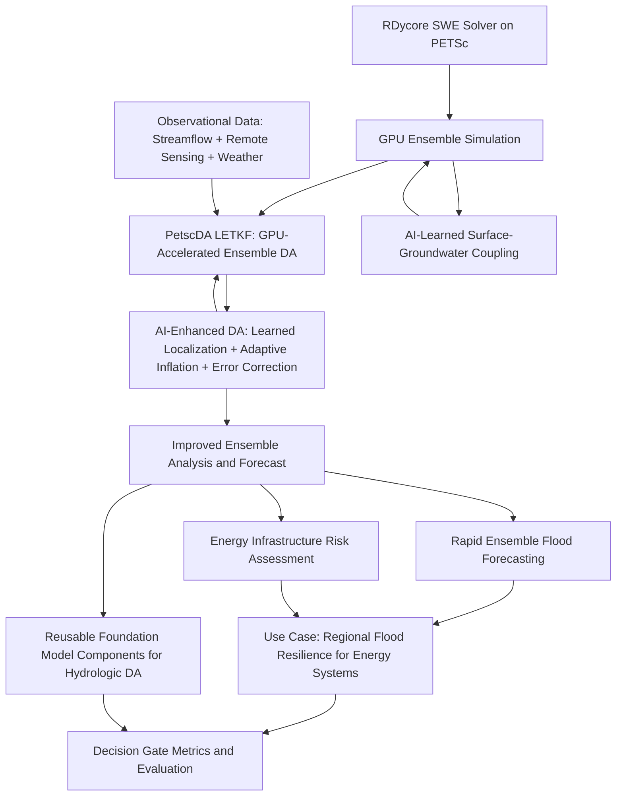

# Genesis Mission FOA Response Plan
## DE-FOA-0003612 — Topic 15-B: Water and Energy

---

## 1. Executive Summary

This plan outlines a strategy for responding to the DOE Genesis Mission FOA
(DE-FOA-0003612) under **Topic 15: Predicting U.S. Water for Energy**, **Focus
Area B: Water and Energy**. The proposal will leverage **RDycore** — a
performance-portable, GPU-capable river/compound flooding model built on
**PETSc** and designed for integration with DOE's **E3SM** — to develop
AI-enhanced flood prediction capabilities that improve water availability
forecasting for energy infrastructure resilience.

The primary AI contributions are:

1. **AI-enhanced ensemble data assimilation**: coupling RDycore's high-fidelity
   SWE solver with PETSc's new `PetscDA` LETKF framework and training neural
   networks to learn adaptive localization functions, inflation factors, and
   model error corrections — replacing hand-tuned heuristics with data-driven
   operators that improve with observational data.

2. **AI-learned surface-groundwater coupling**: using neural operators trained
   on paired surface-subsurface simulation data to learn exchange fluxes
   between RDycore's surface flow and subsurface hydrology — addressing the
   FOA's core requirement for a "coupled surface-groundwater model" without
   requiring a full 3D groundwater solver in Phase I.

3. **Foundation model components for hydrologic DA**: developing reusable,
   transferable AI operators (localization, inflation, error correction) that
   generalize across watersheds and can serve as building blocks for a future
   hydrologic foundation model on the American Science Cloud.

### Key FOA Facts

| Item | Detail |
|------|--------|
| **FOA Number** | DE-FOA-0003612 |
| **Title** | The Genesis Mission: Transforming Science and Energy with AI |
| **Target Topic** | 15 - Predicting U.S. Water for Energy |
| **Target Focus Area** | B - Water and Energy (BER) |
| **Phase** | Phase I (small team) |
| **Budget** | $500,000 - $750,000 |
| **Duration** | 9 months (July 1, 2026 - March 31, 2027) |
| **Application Deadline** | April 28, 2026, 11:59 PM Eastern |
| **Go/No-Go Review** | 6 months into Phase I |
| **Lead Applicant Type** | DOE/NNSA National Laboratory |

---

## 2. Focus Area B Requirements Analysis

The FOA states that Focus Area B (Water and Energy) seeks:

> The predictive understanding of surface and groundwater is crucial for
> ensuring sufficient water for energy production and for protecting energy
> infrastructure from floods. The core scientific objective is to use advanced
> AI techniques to create a coupled surface-groundwater model that improves
> hydrologic process understanding and informs prediction of water availability.

### Specific Topics of Interest

1. **Integrative models** that utilize data of varying levels of complexity
   including multi-source observational data and high-resolution model outputs
2. **Hierarchy of models** and multi-modeling capabilities ranging from
   process-based models to Foundation models
3. **Transferable, hybrid modeling capabilities** so that advances in one
   region can be translated to another
4. **Robust model evaluation capabilities**

### Mandatory Use Case Requirement

> The applications to this research area must incorporate use cases to develop
> and test a new integrative framework focused on **regional energy needs and
> flood resilience**.

---

## 3. Proposal Strategy: AI-Enhanced RDycore for Flood-Resilient Energy Systems

### 3.1 Vision Statement

Develop an AI-augmented compound flooding prediction framework built on RDycore
and PETSc that:

1. Integrates **multi-source observational data** (streamflow gauges, remote
   sensing, weather data) with high-fidelity RDycore ensemble simulations
   through AI-enhanced data assimilation
2. Uses **AI-learned localization, inflation, and error correction** to
   improve PetscDA LETKF ensemble analysis — replacing hand-tuned heuristics
   with neural operators trained on RDycore simulation data
3. Develops **AI-learned surface-groundwater coupling** — neural operators
   that learn exchange fluxes between surface flow and subsurface hydrology,
   addressing the FOA's core requirement for a coupled surface-groundwater
   model
4. Builds toward a **hierarchy of models** from process-based RDycore through
   AI-enhanced DA to reusable foundation model components for hydrologic
   prediction
5. Demonstrates **transferable hybrid modeling** by applying the AI-DA
   framework across different regional watersheds using RDycore's unstructured
   mesh infrastructure
6. Delivers a **use case focused on flood resilience for energy
   infrastructure** (e.g., power plants, substations, transmission corridors
   in flood-prone regions)

### 3.2 Why AI Provides an Advantage

RDycore solves the 2D shallow water equations using finite volume methods on
unstructured meshes with PETSc. Ensemble data assimilation with PetscDA LETKF
requires tuning localization length scales, inflation factors, and observation
error models — parameters that are currently set by hand and degrade
performance when conditions change. Additionally, coupling surface and
subsurface hydrology traditionally requires expensive 3D groundwater solvers
that are difficult to integrate with GPU-accelerated surface models.
AI provides a decisive advantage by:

- **Learning adaptive localization**: Neural networks can learn localization
  functions from data that outperform fixed Gaspari-Cohn kernels, especially
  on irregular unstructured meshes where isotropic localization is suboptimal
- **Predicting optimal inflation**: AI can predict spatially and temporally
  varying inflation factors that maintain ensemble spread without manual tuning
- **Correcting model error**: Neural correction operators trained on
  analysis increments can reduce systematic bias in RDycore's SWE solver
- **Learning surface-groundwater exchange**: Neural operators can learn
  infiltration, recharge, and baseflow exchange fluxes from paired
  surface-subsurface simulation data, enabling coupled surface-groundwater
  prediction without the computational cost of a full 3D groundwater solver
- **Enabling real-time ensemble forecasting**: GPU-accelerated PetscDA LETKF
  with AI-optimized parameters enables ensemble flood forecasting at
  operational timescales currently infeasible with hand-tuned DA
- **Building toward foundation models**: Reusable AI operators for DA and
  surface-groundwater coupling, trained across diverse watersheds, form the
  building blocks of a hydrologic foundation model — a key FOA priority

### 3.3 Technical Approach



#### Component 1: RDycore Ensemble Simulation and Training Data

- Run RDycore on GPU-accelerated HPC systems across a matrix of:
  - Watershed geometries (multiple regional domains)
  - Forcing scenarios (precipitation, boundary conditions)
  - Parameter variations (Manning's n, bed elevation perturbations)
  - Initial conditions (antecedent soil moisture proxies)
- Generate curated ensemble simulation archives that serve as:
  - Training data for AI-learned DA operators
  - Reference solutions for validation of the AI-DA framework
- Leverage RDycore's built-in ensemble support and GPU performance
  (6.6–41.9x speedup over CPUs demonstrated at 471M cell scale)

#### Component 2: AI-Enhanced Data Assimilation (PetscDA LETKF + AI Operators)

- **Ensemble DA Baseline (PetscDA)**: PETSc now includes a dedicated
  **`PetscDA` data assimilation object** (in the `petsc_gem` branch) with
  production-quality implementations of:
  - **ETKF** (Ensemble Transform Kalman Filter) — [`PETSCDAETKF`](../petsc_gem/src/ml/da/impls/ensemble/etkf/etkfilter.c)
  - **LETKF** (Local Ensemble Transform Kalman Filter) — [`PETSCDALETKF`](../petsc_gem/src/ml/da/impls/ensemble/letkf/letkfilter.c)
    with **GPU-accelerated batched eigendecomposition** via Kokkos
    (CUDA/HIP/SYCL) — [`letkf_local_anal.kokkos.cxx`](../petsc_gem/src/ml/da/impls/ensemble/letkf/kokkos/letkf_local_anal.kokkos.cxx)
  - Localization support for scalable analysis on large grids
  - Working **shallow water equation tutorials** including 1D dam-break
    ([`ex3.c`](../petsc_gem/src/ml/da/tutorials/ex3.c)) and 2D wave
    propagation ([`ex4.c`](../petsc_gem/src/ml/da/tutorials/ex4.c))
    demonstrating LETKF with SWE — the exact physics RDycore solves
- **AI-learned localization**: Train neural networks to replace the
  hand-tuned Gaspari-Cohn localization matrix Q with a learned operator
  that adapts to mesh geometry, flow regime, and observational density
- **Adaptive inflation**: Train AI to predict spatially varying inflation
  factors from ensemble statistics, replacing fixed scalar inflation
- **Model error correction**: Use LETKF analysis increments as training
  signal to learn systematic bias corrections for RDycore's SWE solver
- **Variational DA complement (TSAdjoint + TAO)**: PETSc's TSAdjoint
  framework computes exact gradients of cost functions w.r.t. initial
  conditions and parameters. Working examples include
  [`spectraladjointassimilation.c`](../petsc_gem/src/tao/unconstrained/tutorials/spectraladjointassimilation.c)
  and [`ex20opt_ic.c`](../petsc_gem/src/ts/tutorials/ex20opt_ic.c)
- **Hybrid ensemble-variational**: Combine PetscDA ensemble covariances
  with TSAdjoint-computed gradients for hybrid EnVar assimilation
- Use PETSc's TSTrajectory checkpointing for efficient forward/adjoint
  solution storage and replay

#### Component 3: AI-Learned Surface-Groundwater Coupling

The FOA's core scientific objective requires a "coupled surface-groundwater
model." Rather than integrating a full 3D groundwater solver (which would
dominate the 9-month Phase I timeline), we propose an AI-first approach:

- **Training data generation**: Use existing paired surface-subsurface
  simulation datasets (e.g., from ParFlow-CLM, ATS, or PFLOTRAN runs over
  the target watershed) to create training pairs of surface states and
  corresponding groundwater exchange fluxes (infiltration, recharge, baseflow)
- **Neural operator training**: Train a neural operator (e.g., DeepONet or
  Fourier Neural Operator) to predict groundwater exchange fluxes given
  surface water states (h, hu, hv), soil properties, and antecedent conditions
- **Integration with RDycore**: Add the AI-predicted exchange fluxes as
  source/sink terms in RDycore's SWE solver, enabling coupled
  surface-groundwater prediction without a full subsurface solver
- **Validation**: Compare AI-coupled predictions against reference
  ParFlow/ATS solutions on held-out scenarios
- **Foundation model pathway**: The trained neural operator becomes a
  reusable, transferable component — a building block for a hydrologic
  foundation model that can be shared on the American Science Cloud

This approach directly addresses the FOA requirement while keeping the
Phase I scope feasible. Phase II would extend to tighter coupling with a
full groundwater model.

#### Component 4: Use Case — Flood Resilience for Energy Infrastructure

- Select a regional watershed with significant energy infrastructure
  (e.g., Houston/Gulf Coast region — leveraging existing RDycore Houston1km
  mesh and data already in the codebase)
- Demonstrate rapid ensemble flood forecasting for energy facility protection
- Include AI-learned groundwater coupling to capture compound flooding
  from both surface runoff and groundwater-driven flooding
- Quantify AI advantage: DA analysis quality improvement, ensemble spread
  calibration, and decision-relevant lead time improvements vs. baseline
  LETKF with hand-tuned parameters

---

## 4. Team Composition Requirements

The FOA requires Phase I teams to include institutions from **at least two** of:
1. DOE/NNSA National Laboratory or Scientific User Facility
2. Industry
3. Institute of Higher Education (IHE) / Non-profit / Other

### Recommended Team Structure

| Role | Institution Type | Suggested Responsibilities |
|------|-----------------|---------------------------|
| **Lead PI** | DOE National Lab | Overall project leadership, RDycore development, HPC simulation, PetscDA integration |
| **Co-PI 1** | University (IHE) | AI/ML for data assimilation and surface-groundwater coupling, neural operators, graduate student involvement |
| **Co-PI 2** | Industry Partner | Energy infrastructure use case data, operational flood risk perspective, path to deployment |
| **Co-PI 3** (optional) | Second DOE Lab or University | Subsurface hydrology expertise, groundwater simulation data for AI training, observational data access |

### Key Expertise Needed

- **Computational hydrology / shallow water equations** — RDycore team
- **PETSc / HPC software engineering** — RDycore/PETSc developers
- **PetscDA / ensemble data assimilation** — PetscDA developer (ETKF/LETKF)
- **AI/ML for scientific computing** — neural operators, learned DA operators
- **Subsurface hydrology / groundwater modeling** — for surface-groundwater
  coupling training data (e.g., ParFlow, ATS, or PFLOTRAN expertise)
- **Flood risk assessment for energy systems** — domain expert
- **Observational hydrology / data assimilation** — data scientist
- **GPU computing / performance portability** — HPC engineer (Kokkos)

### Partner Identification Actions

- [ ] Identify 1-2 university partners with AI/ML for scientific computing
  expertise (e.g., groups working on neural operators, learned DA, or
  machine learning for geophysical inverse problems)
- [ ] Identify a partner with subsurface hydrology / groundwater modeling
  expertise and existing simulation datasets for the target watershed
  (e.g., groups running ParFlow, ATS, or PFLOTRAN)
- [ ] Identify an industry partner in the energy sector with flood risk
  concerns (e.g., utility company, energy infrastructure operator, or
  AI-for-energy startup)
- [ ] Secure Letters of Commitment from all partner institutions
- [ ] If applicable, obtain written authorization from cognizant DOE
  Contracting Officer for lab participation

### Submission Structure: Collaborative Applications

The FOA strongly prefers **collaborative applications** over subawards.
Each partner institution submits its own application through Grants.gov
with an **identical Project Narrative** but institution-specific budgets.
DOE combines these into one document for merit review.

- Lead institution submits the Excel template (Field 12) with all
  senior/key personnel, partner institutions, and budget summary
- Each partner submits identical narrative + own SF-424, budget, bio sketches
- Unfunded partners (e.g., industry providing in-kind) do not submit
  separately; lead includes their info

---

## 5. Project Narrative Structure (5-page limit)

The FOA strongly encourages the following organization:

### Page 1: Background/Introduction (~1 page)

**Key messages to convey:**
- Compound flooding threatens U.S. energy infrastructure; current prediction
  tools lack the observational integration and surface-groundwater coupling
  needed for reliable ensemble forecasting
- RDycore is a DOE-funded, GPU-capable, PETSc-based SWE solver designed for
  E3SM — representing years of DOE investment in process-based modeling
- AI can dramatically improve ensemble data assimilation by learning
  adaptive localization, inflation, and error correction operators from data
- AI can also bridge the surface-groundwater gap by learning exchange fluxes
  from paired simulation data, enabling coupled prediction without the
  computational cost of a full 3D groundwater solver
- This project will create an AI-enhanced DA framework with AI-learned
  surface-groundwater coupling that improves RDycore ensemble forecast
  quality — building toward reusable foundation model components for
  hydrologic prediction
- **ASCR co-funding relevance**: This project advances applied mathematics
  (AI-learned covariance operators for DA), scientific software (PETSc/PetscDA
  AI-DA interfaces), and GPU computing (Kokkos-accelerated ensemble DA) —
  core ASCR mission areas
- **Buy America statement**: This project does not involve construction,
  alteration, maintenance, or repair of public infrastructure

### Page 1.5: Project Objectives (~0.5 page)

**Objectives aligned with Focus Area B:**
1. Couple RDycore's GPU-accelerated SWE ensemble solver with PetscDA LETKF
   for operational ensemble data assimilation
2. Develop AI-learned localization operators that outperform hand-tuned
   Gaspari-Cohn localization on RDycore's unstructured mesh
3. Develop AI-learned adaptive inflation and model error correction operators
   trained on LETKF analysis increments
4. Develop AI-learned surface-groundwater coupling operators that predict
   exchange fluxes from surface states, creating a coupled surface-groundwater
   prediction capability
5. Demonstrate transferability of the AI-DA and AI-coupling framework across
   at least two regional watersheds without manual re-tuning
6. Deliver a use case demonstrating AI-enhanced ensemble flood forecasting
   with surface-groundwater coupling for energy infrastructure resilience
7. Produce reusable, transferable AI operators as foundation model components
   for the American Science Cloud

### Pages 2-3.5: Proposed Research and Methods (~1.5 pages)

**Task 1: RDycore Ensemble Simulation and Data Generation (Months 1-3)**
- PI: Lab lead
- Generate RDycore simulation ensembles on GPU clusters across diverse
  forcing scenarios, parameter variations, and watershed geometries
- Obtain or generate paired surface-subsurface simulation data for AI
  groundwater coupling training (from partner with ParFlow/ATS/PFLOTRAN)
- Curate AI-ready datasets of ensemble trajectories, analysis increments,
  and surface-groundwater exchange fluxes
- Budget: ~15% of total

**Task 2: PetscDA LETKF Integration with RDycore (Months 1-4)**
- PI: Lab lead (PetscDA/RDycore integration)
- Couple RDycore with PetscDA LETKF for GPU-accelerated ensemble DA
- Implement observation operators for streamflow gauges and remote sensing
- Establish baseline LETKF performance with hand-tuned localization
- Budget: ~20% of total

**Task 3: AI-Enhanced DA Operators (Months 3-7)**
- PI: University partner (AI/ML) + Lab lead (DA integration)
- Train neural networks to learn adaptive localization functions from
  ensemble simulation data and analysis increments
- Develop AI-learned inflation and model error correction operators
- Integrate AI operators into PetscDA LETKF analysis cycle
- Budget: ~20% of total

**Task 4: AI-Learned Surface-Groundwater Coupling (Months 3-7)**
- PI: University partner (AI/ML) + Groundwater partner
- Train neural operators (DeepONet/FNO) on paired surface-subsurface data
  to predict groundwater exchange fluxes from surface states
- Integrate AI-predicted exchange fluxes as source/sink terms in RDycore
- Validate against reference subsurface model solutions
- Budget: ~20% of total

**Task 5: Energy Infrastructure Flood Resilience Use Case (Months 5-9)**
- PI: Industry partner + Lab lead
- Apply AI-enhanced DA framework with surface-groundwater coupling to
  Houston or similar energy-critical region
- Demonstrate ensemble forecasting capability with AI-improved analysis
- Quantify AI advantage: DA quality improvement vs. hand-tuned baseline
- Evaluate scaling behavior: performance vs. training data volume
- Budget: ~20% of total

**Project Management and Coordination (Throughout)**
- Budget: ~5% of total

### Pages 3.5-4.5: Milestones (~1 page)

| Month | Milestone | Go/No-Go Criterion |
|-------|-----------|-------------------|
| 1 | RDycore ensemble runs initiated; PetscDA LETKF baseline established; paired surface-subsurface data acquisition begun | N/A |
| 2 | First ensemble dataset generated; observation operators implemented; groundwater training data curated | Dataset quality metrics met |
| 3 | **Go/No-Go**: PetscDA LETKF coupled with RDycore; baseline DA functional | LETKF analysis reduces RMSE vs. free ensemble |
| 4 | AI localization training initiated; AI groundwater coupling training initiated | Training data sufficient for both AI tasks |
| 5 | AI localization operator trained; AI groundwater coupling operator trained | AI localization outperforms hand-tuned; AI coupling matches reference model |
| 6 | **6-Month Go/No-Go Review**: Full AI-DA + AI-coupling framework demonstrated | AI-DA improves analysis quality; AI coupling captures exchange fluxes; framework runs on 2 watersheds |
| 7 | Energy infrastructure use case initiated with coupled surface-groundwater | Use case domain and data secured |
| 8 | Ensemble forecasting demonstration with AI-enhanced DA + groundwater coupling | Ensemble calibration metrics improved vs. baseline |
| 9 | Final evaluation, foundation model component packaging, Phase II planning | All decision gate metrics met; AI operators packaged for AmSC |

### Pages 4.5-4.75: Data Sources and Models (~0.5 page)

**Data Sources:**
- RDycore-generated ensemble simulation data (primary DA training data)
- Paired surface-subsurface simulation data from ParFlow/ATS/PFLOTRAN
  (groundwater coupling training data — from partner)
- USGS streamflow gauge data (validation/assimilation)
- NOAA precipitation and weather data (forcing)
- NHDPlus/NWM watershed geometry data
- Energy infrastructure location data (DOE/EIA)
- Existing RDycore test cases (Houston1km mesh already in codebase)

**AI Models/Frameworks:**
- PyTorch/JAX for neural network training (localization, inflation,
  groundwater coupling operators)
- DeepONet or Fourier Neural Operator for surface-groundwater coupling
- PETSc for solver infrastructure and data management
- **PetscDA** (ETKF/LETKF) for GPU-accelerated ensemble data assimilation
- PETSc TSAdjoint/TAO for variational DA and parameter optimization
- RDycore for high-fidelity SWE ensemble solutions
- E3SM for broader Earth system context

**Hierarchy of Models (FOA requirement):**
1. **Process-based**: RDycore SWE solver (high-fidelity, GPU-accelerated)
2. **AI-enhanced process-based**: RDycore + AI-learned DA operators +
   AI-learned groundwater coupling
3. **Foundation model components**: Reusable, transferable AI operators
   for localization, inflation, error correction, and surface-groundwater
   exchange — building blocks for a future hydrologic foundation model

### Pages 4.75-5: Decision Gate Metrics (~0.5 page)

**Decision Gate Metrics (for 6-month go/no-go):**
1. **DA quality**: PetscDA LETKF coupled with RDycore reduces ensemble RMSE
   vs. free ensemble forecast
2. **AI localization**: AI-learned localization outperforms hand-tuned
   Gaspari-Cohn localization on held-out validation scenarios
3. **Calibration**: AI-enhanced ensemble is better calibrated (CRPS, spread/
   skill ratio) than baseline LETKF with fixed parameters
4. **Surface-groundwater coupling**: AI-learned coupling operator reproduces
   reference subsurface model exchange fluxes with < 10% relative error
5. **Transferability**: AI-DA and AI-coupling framework successfully applied
   to at least 2 distinct watersheds without re-tuning by hand
6. **Scaling behavior** (FOA-emphasized metric): AI-DA and AI-coupling
   performance improves monotonically with additional training data,
   computing resources, and observational data — demonstrating a clear
   AI advantage trajectory that justifies Phase II investment

---

## 6. Required Application Components Checklist

### Forms and Documents

- [ ] **SF-424 (R&R)** — Cover page with all required fields
- [ ] **Research and Related Other Project Information** — Questions 1-6
- [ ] **Project Summary/Abstract** (1 page max) — Vision, AI advantage, team
- [ ] **DOE Title Page** — Project title, lead institution, PI info, RFA
  number, focus area "15-B Predicting U.S. Water for Energy | Water and
  Energy", senior/key personnel table, summary budget table
- [ ] **Project Narrative** (5 pages max) — As structured above
- [ ] **Appendix 1: Bibliography and References Cited** (no page limit)
- [ ] **Appendix 2: Facilities and Other Resources** (0.5 page max) —
  HPC resources, GPU clusters, data storage
- [ ] **Appendix 3: Equipment** (0.5 page max)
- [ ] **Appendix 4: Data Management and Sharing Plan** — NOT required at
  application; required at award negotiation
- [ ] **Appendix 5: Synergistic Activities** (optional, 1 page per person)
- [ ] **Appendix 6: Transparency of Foreign Connections** — Lab exempt;
  required for non-lab partners
- [ ] **Appendix 7: Other Attachments** — Letters of Commitment from all
  partners, Letters of Collaboration/Access
- [ ] **Research and Related Senior/Key Person Profile (Expanded)** —
  Biographical sketches (SciENcv format) and Current & Pending Support
  for all senior/key personnel
- [ ] **Research and Related Budget** — Single 9-month period
  (July 1, 2026 - March 31, 2027)
- [ ] **Budget Justification** — Detailed justification for all costs
- [ ] **Identification of Merit Reviewer Conflicts** — Excel template,
  attach to Field 12
- [ ] **Excel template** for focus area, senior/key personnel, partner
  institutions, and budget — attach to Field 12

### Administrative Actions

- [ ] Ensure SAM.gov registration is current
- [ ] Ensure Grants.gov registration and AOR role are active
- [ ] Obtain DOE Contracting Officer authorization for lab participation
- [ ] Register in PAMS after submission
- [ ] Register with FedConnect
- [ ] Register with FSRS

---

## 7. Budget Framework (Phase I: $500K-$750K over 9 months)

### Suggested Budget Allocation

| Category | Estimated % | Notes |
|----------|------------|-------|
| Senior/Key Personnel (Lab) | 25-30% | PI + 1-2 co-PIs at lab |
| Other Personnel (Lab) | 10-15% | Postdoc, research staff |
| University Subaward(s) | 20-25% | AI/ML co-PI + graduate student |
| Industry Subaward | 5-10% | Up to 20% of total for industry |
| Travel | 3-5% | Genesis Mission meetings (up to 2), partner coordination |
| Computing/ADP Services | 5-10% | Cloud computing, GPU allocations if needed |
| Materials and Supplies | 2-3% | Software licenses, data storage |
| Indirect Costs | Per negotiated rate | Lab and subaward rates |

### Budget Notes

- Phase I budget period: single period, July 1, 2026 - March 31, 2027
- Industry partner funding limited to up to 20% of total requested budget
- For-profit entities require 20% cost share for R&D activities
- DOE Labs are exempt from cost sharing
- Include travel for up to 2 Genesis Mission annual meetings
- Computing costs for GPU-accelerated RDycore ensemble runs and AI training

---

## 8. Review Criteria Alignment

The FOA lists review criteria in descending order of importance:

### Criterion 1: Scientific and/or Technical Merit and Impact (Highest Weight)

**How we address it:**
- Novel integration of AI-learned DA operators with a production-quality DOE
  SWE solver (RDycore) and GPU-accelerated ensemble DA framework (PetscDA)
- AI-learned surface-groundwater coupling addresses the FOA's core
  requirement for a "coupled surface-groundwater model" using a novel
  AI-first approach rather than traditional solver coupling
- Clear AI advantage: AI-learned localization, inflation, and groundwater
  coupling operators improve ensemble prediction quality beyond what
  hand-tuning or traditional coupling can achieve
- Direct impact on water-energy nexus — protecting energy infrastructure
  from compound flooding (surface + groundwater) through improved ensemble
  flood forecasting
- Builds on years of DOE investment in RDycore, PETSc, and E3SM
- Produces reusable foundation model components for the Genesis Mission

### Criterion 2: Technical Approach, Methods, and Feasibility

**How we address it:**
- Well-defined task structure with clear milestones and quantitative go/no-go
- Proven base technology (RDycore is operational, GPU-capable, tested)
- **PetscDA already demonstrates ensemble DA on SWE** — the exact physics
  RDycore solves — with GPU-accelerated LETKF including working tutorials
  for 1D dam-break and 2D wave propagation
- AI-learned localization and inflation are established research directions
  in geophysical DA, novel in this application context with unstructured meshes
- AI-learned surface-groundwater coupling uses proven neural operator
  architectures (DeepONet, FNO) applied to a well-defined input-output
  mapping problem with available training data
- Risk mitigation: PetscDA provides a working DA baseline even if AI
  augmentation underperforms; AI operators are additive improvements;
  groundwater coupling can fall back to empirical parameterizations
- Realistic 9-month timeline with quantitative go/no-go criteria
- Hierarchy of models from process-based through AI-enhanced to foundation
  model components — directly addressing FOA requirements

### Criterion 3: Team, Resources, and Management

**How we address it:**
- DOE Lab leadership with deep RDycore/PETSc expertise
- University partner(s) with AI/ML for scientific computing research strength
- Subsurface hydrology partner for groundwater coupling training data
- Industry partner providing real-world energy infrastructure context
- Access to DOE HPC resources (GPU clusters)
- Clear role delineation across institutions
- Collaborative application structure (FOA-preferred)

### Criterion 4: Commercialization Potential for Energy Applications

**Note:** This criterion applies only to "applied technology development
applications." Our proposal spans fundamental research (AI-learned DA
operators) and applied technology (flood forecasting for energy
infrastructure). We should address this criterion to strengthen the
application:

**How we address it:**
- AI-enhanced flood forecasting has clear commercial value for utilities,
  energy infrastructure operators, and insurance companies
- Reusable AI operators for DA and surface-groundwater coupling can be
  deployed across the water-energy sector
- Industry partner provides a direct path to operational deployment
- Foundation model components hosted on AmSC enable broad adoption

### Criterion 5: Budget and Cost-Effectiveness

**How we address it:**
- Leverages existing DOE-funded software (RDycore, PETSc, PetscDA, E3SM)
- PetscDA eliminates need to develop DA infrastructure from scratch
- AI-first groundwater coupling avoids the cost of integrating a full 3D
  subsurface solver in Phase I
- Efficient use of GPU computing for simulation, DA, and AI training
- Reasonable budget within Phase I range
- Clear value proposition for Phase II scale-up

### ASCR Co-Funding Relevance

The FOA states that "ASCR intends to work with all offices partnering on
this solicitation to identify promising co-funding opportunities in all
focus areas." This proposal is strongly aligned with ASCR's mission:

- **Applied mathematics**: AI-learned covariance operators for ensemble DA
  represent a novel contribution to computational inverse problems and
  uncertainty quantification
- **Scientific software**: PETSc/PetscDA AI-DA interfaces advance the
  state of the art in scientific software for data assimilation
- **GPU computing**: Kokkos-accelerated ensemble DA with AI operators
  demonstrates performance-portable AI-HPC integration
- **Neural operators for multiphysics coupling**: AI-learned
  surface-groundwater coupling advances neural operator methodology for
  scientific computing

---

## 9. Phase II Vision (for narrative context)

While the Phase I application focuses on the 9-month proof of concept, the
narrative should hint at the Phase II vision (3 years, 3-5x budget):

- Scale the AI-enhanced DA + AI-coupled surface-groundwater framework to
  continental-scale watersheds
- Full integration with E3SM for coupled atmosphere-surface-subsurface
  water prediction
- Tighter coupling with a full groundwater model (ParFlow/ATS) — using
  Phase I's AI coupling as initialization and the full model for validation
- Operational deployment for real-time flood warning at energy facilities
- Full hydrologic foundation model development — combining AI-DA operators,
  surface-groundwater coupling, and multi-watershed training into a
  transferable, self-improving model hosted on the American Science Cloud
- Broader Genesis Mission integration — sharing AI-DA models, training
  datasets, and foundation model components on the AmSC
- Cross-topic synergies with Topic 16 (Grid) for flood-related grid
  resilience and Topic 21 (AFFECT) for fluid flow AI methods

---

## 10. Timeline to Submission

| Date | Action |
|------|--------|
| **Now - April 1** | Identify and secure partner commitments; begin narrative drafting |
| **March 26** | Attend DOE informational webinar (3 PM Eastern) |
| **April 1-10** | Complete draft narrative; circulate to team for review |
| **April 10-15** | Prepare budget, biographical sketches, C&P support |
| **April 15-20** | Finalize all forms; internal review and approval |
| **April 20-25** | Submit through Grants.gov (allow buffer for technical issues) |
| **April 28** | **DEADLINE: 11:59 PM Eastern** |

---

## 11. Key Risks and Mitigations

| Risk | Mitigation |
|------|-----------|
| AI localization operators may not generalize across watersheds | Design mesh-invariant neural architectures; include diverse training domains; hand-tuned LETKF remains functional fallback |
| AI-learned groundwater coupling may not capture all exchange processes | Focus on dominant fluxes (infiltration, baseflow); validate against reference model; fall back to empirical parameterizations if needed |
| Insufficient paired surface-subsurface training data | Partner with group that has existing ParFlow/ATS/PFLOTRAN runs; generate additional training data on target watershed; use transfer learning from data-rich to data-poor domains |
| Insufficient ensemble diversity for AI training | Leverage RDycore's GPU capability for rapid ensemble generation; use Latin hypercube sampling for parameter space |
| Data assimilation integration too complex | **LOW RISK**: PetscDA already has working SWE+LETKF tutorials; Phase 1 RDycore+LETKF integration already demonstrated |
| Industry partner difficult to secure quickly | Engage Genesis Mission Consortium partnership service; leverage existing DOE lab industry relationships |
| 9-month timeline too aggressive for 5 tasks | Front-load data generation; PetscDA provides working DA baseline from month 1; parallelize AI-DA and AI-coupling development (Tasks 3 and 4 run concurrently) |
| Computing resource constraints | Leverage DOE lab allocations; PetscDA LETKF runs on GPU via Kokkos |
| AI-learned inflation may be unstable | Constrain inflation to physically meaningful range; use ensemble diagnostics as regularization |
| Groundwater partner may not have data for target watershed | Use synthetic training data from idealized domains; validate approach on available data; acquire target watershed data in parallel |

---

## 12. Connections to Genesis Mission Ecosystem

The proposal should emphasize integration with the broader Genesis Mission:

- **American Science Cloud (AmSC)**: Commit to hosting the following
  concrete artifacts on the platform:
  - Trained AI-DA operators (localization, inflation, error correction)
    as downloadable model weights with inference APIs
  - Trained AI surface-groundwater coupling operators
  - Curated ensemble simulation training datasets with metadata
  - Evaluation benchmarks for AI-DA and AI-coupling quality
  - Jupyter notebooks demonstrating operator usage
- **Transformational AI Models Consortium (ModCon)**: Contribute AI-enhanced
  DA operators and surface-groundwater coupling operators to the consortium's
  portfolio as foundation model components
- **Cross-topic synergies**: The AI-enhanced DA framework could benefit
  Topic 16 (Grid) for flood-related grid resilience, and Topic 21 (AFFECT)
  for fluid flow AI methods. The AI-learned surface-groundwater coupling
  methodology is directly relevant to Topic 17 (Subsurface Energy)
- **Open science**: Commit to open-source release of AI-DA operators and
  training pipelines (RDycore and PETSc are already open source under
  BSD-2-Clause; SPDX: BSD-2-Clause)
- **ASCR co-funding**: Emphasize advances in applied mathematics (AI-learned
  covariance operators), computer science (AI-HPC integration), and
  scientific software (PETSc/RDycore AI-DA interfaces) to attract ASCR
  co-funding interest
- **Platform integration**: Commit to using Genesis Mission computing
  resources when practical for AI training and ensemble simulation;
  participate in up to 2 annual Genesis Mission meetings

### Award Instrument Notes

The FOA uses **Other Transaction Agreements (OTA)** rather than traditional
grants. Key implications:
- DOE intends fast-track OTA with either milestone-based or cost-reimbursement
  structure
- IP terms will be negotiated under OTA (similar to Bayh-Dole but flexible)
- DOE Labs are funded through the Field Work Proposal system, not the OTA
- Administrative provisions of the RFA may not apply to lab subcontractors

---

## 13. PETSc Data Assimilation Capabilities for the Proposal

PETSc now has **two complementary data assimilation frameworks** that should
be central to the proposal's technical approach. Together they provide a
mature, GPU-accelerated, scalable foundation that **dramatically reduces
technical risk** and demonstrates immediate feasibility.

### 13.1 PetscDA — Ensemble Data Assimilation Object (NEW — in petsc_gem)

The `petsc_gem` branch of PETSc introduces a **first-class `PetscDA` object**
for data assimilation (header: [`petscda.h`](../petsc_gem/include/petscda.h),
implementation: [`petscda.c`](../petsc_gem/src/ml/da/interface/petscda.c)).
This is distinct from `DMDA` (structured grid DM) — `PetscDA` is a new
abstract object specifically for data assimilation algorithms.

#### API Overview

| Function | Purpose |
|----------|---------|
| [`PetscDACreate()`](../petsc_gem/src/ml/da/interface/petscda.c) | Create a DA object |
| `PetscDASetType()` | Select algorithm: `PETSCDAETKF` or `PETSCDALETKF` |
| `PetscDASetSizes()` | Set state and observation dimensions |
| `PetscDASetNDOF()` | Set degrees of freedom per grid point |
| `PetscDAEnsembleSetSize()` | Set number of ensemble members |
| `PetscDAEnsembleAnalysis()` | Perform analysis step given observations |
| `PetscDAEnsembleForecast()` | Advance all ensemble members via user callback |
| `PetscDAEnsembleInitialize()` | Initialize ensemble from mean + perturbations |
| `PetscDASetObsErrorVariance()` | Set observation error covariance |
| `PetscDALETKFSetLocalization()` | Set localization matrix for LETKF |

#### Implementations

1. **ETKF** ([`etkfilter.c`](../petsc_gem/src/ml/da/impls/ensemble/etkf/etkfilter.c)):
   Global Ensemble Transform Kalman Filter following Algorithm 6.4 of
   Asch, Bocquet, and Nodet (2016)

2. **LETKF** ([`letkfilter.c`](../petsc_gem/src/ml/da/impls/ensemble/letkf/letkfilter.c)):
   Local Ensemble Transform Kalman Filter with:
   - **Localization support** via sparse localization matrix Q
   - **GPU-accelerated batched eigendecomposition** via Kokkos
     ([`letkf_local_anal.kokkos.cxx`](../petsc_gem/src/ml/da/impls/ensemble/letkf/kokkos/letkf_local_anal.kokkos.cxx))
   - Support for **CUDA** (cusolverDn), **HIP** (rocsolver), and **SYCL** (oneMKL)
   - MPI-parallel with observation scattering and local work vectors
   - Persistent solver handles and workspace for efficiency

#### Tutorials — Already Demonstrating SWE + DA

| Tutorial | Description | Key Features |
|----------|-------------|--------------|
| [`ex1.c`](../petsc_gem/src/ml/da/tutorials/ex1.c) | ETKF on Lorenz-96 | Baseline chaotic system DA |
| [`ex2.c`](../petsc_gem/src/ml/da/tutorials/ex2.c) | LETKF on Lorenz-96 | Localized DA comparison |
| [`ex3.c`](../petsc_gem/src/ml/da/tutorials/ex3.c:1) | **1D SWE dam-break + LETKF** | Rusanov/MC flux, 2 DOF per point |
| [`ex4.c`](../petsc_gem/src/ml/da/tutorials/ex4.c:1) | **2D SWE wave + LETKF** | 3 DOF per point, Kokkos GPU, MPI parallel |

The `ex3` and `ex4` tutorials are **directly relevant** — they solve the
same shallow water equations that RDycore solves, using the same finite
volume approach, and demonstrate working LETKF data assimilation with
ensemble forecast/analysis cycles. The `ex4` tutorial even runs on GPU
via Kokkos with batched eigendecomposition.

#### Internal Data Structure

```c
struct _p_PetscDA {
  PetscInt obs_size;         /* Observation vector dimension p */
  PetscInt state_size;       /* State vector dimension n */
  Vec      obs_error_var;    /* Observation error variance */
  Mat      R;                /* Observation error covariance p x p */
  PetscInt ndof;             /* DOF per grid point */
};

typedef struct {
  PetscInt  size;      /* Number of ensemble members m */
  Mat       ensemble;  /* Ensemble matrix n x m */
  PetscReal inflation; /* Inflation factor */
} PetscDA_Ensemble;
```

### 13.2 TSAdjoint — Discrete Adjoint Framework

PETSc's `TSAdjoint` provides a complementary framework for computing
sensitivities of cost functions with respect to initial conditions and
parameters:

- **`TSAdjointSolve()`** — Solves the discrete adjoint problem for ODE/DAE
  systems, computing gradients w.r.t. initial conditions and parameters
- **`TSTrajectory`** — Saves forward solution trajectories with configurable
  checkpointing strategies for efficient adjoint computation
- **Second-order adjoints** — Supports Hessian-vector products

### 13.3 Existing Variational DA Examples

- **[`spectraladjointassimilation.c`](../petsc_gem/src/tao/unconstrained/tutorials/spectraladjointassimilation.c)**
  — Complete 4D-Var data assimilation: 1D advection-diffusion + TSAdjoint + TAO
- **[`ex20opt_ic.c`](../petsc_gem/src/ts/tutorials/ex20opt_ic.c)** — Optimizes
  initial conditions using TAO + TSAdjoint
- **[`ex20opt_p.c`](../petsc_gem/src/ts/tutorials/ex20opt_p.c)** — Optimizes
  model parameters using TAO + TSAdjoint with second-order adjoint

### 13.4 How to Leverage Both Frameworks in the Proposal

The proposal should highlight a **four-tier strategy**:

1. **PetscDA ensemble DA for RDycore (immediate)**: Couple RDycore's SWE
   solver with PetscDA's LETKF to perform GPU-accelerated ensemble data
   assimilation. The existing SWE tutorials in PetscDA demonstrate this
   is feasible with minimal integration effort. RDycore provides the
   forecast model; PetscDA manages the ensemble analysis.

2. **AI-augmented ensemble DA**: Train neural networks to:
   - Learn adaptive localization functions (replacing hand-tuned Q matrices)
   - Correct ensemble spread deficiencies and model error
   - Predict optimal inflation factors
   - Use LETKF analysis increments as training signal

3. **AI-learned surface-groundwater coupling**: Train neural operators to
   predict groundwater exchange fluxes from surface states, enabling
   coupled surface-groundwater prediction without a full 3D subsurface
   solver. This addresses the FOA's core requirement for a "coupled
   surface-groundwater model."

4. **Hybrid ensemble-variational (EnVar)**: Combine PetscDA ensemble
   covariances with TSAdjoint-computed gradients for hybrid 4D-EnVar
   assimilation, with AI learning to optimally blend the two.

5. **TAO for joint optimization**: Use TAO to jointly optimize
   physics-based parameters (Manning's n) and AI model weights.

### 13.5 Technical Advantage Statement (Updated)

> RDycore's foundation on PETSc provides immediate access to **two
> complementary data assimilation frameworks**: (1) the new `PetscDA`
> ensemble DA object with GPU-accelerated ETKF and LETKF implementations
> that have already been demonstrated on shallow water equations identical
> to those RDycore solves, and (2) the mature TSAdjoint/TAO variational
> DA framework. This combination is unique in the scientific computing
> landscape — no other flood modeling framework has both ensemble and
> variational DA built into its solver infrastructure with GPU
> acceleration. By adding AI-learned surface-groundwater coupling, we
> create a complete surface-subsurface prediction system that addresses
> the FOA's core requirement without the computational overhead of
> traditional solver coupling. The integration of AI techniques with
> these existing capabilities represents a low-risk, high-reward approach
> that builds on proven infrastructure rather than developing DA or
> groundwater coupling from scratch.

---

## 14. RDycore Paper — Key Facts for the Proposal

Source: Bisht et al., "Development of a River Dynamical Core for E3SM to
Simulate Compound Flooding on Exascale-class Heterogeneous Supercomputers,"
submitted to Environmental Modelling & Software, Dec 2025.

### 14.1 Performance Numbers to Cite

| Metric | Value | Context |
|--------|-------|---------|
| Problem scale | 471M grid cells, 1.4B unknowns | Hurricane Harvey at 1.5m resolution |
| GPU speedup - Perlmutter | 6.6x-32.9x vs CPUs | NVIDIA A100, 5-320 nodes |
| GPU speedup - Frontier | 7.6x-41.9x vs CPUs | AMD MI250X, 5-320 nodes |
| E3SM-coupled SYPD on GPU | 0.90 Perlmutter, 0.63 Frontier | 15x-21x over CPU |
| Peak throughput | 449M cells/sec Perlmutter, 384M cells/sec Frontier | 320 GPU nodes |
| Harvey mesh | ~2.9M triangular cells, ~21m resolution | 5-day sim, 5 precip datasets |
| Malpasset dam break R² | 0.99 | Against observations at 9 gauges |

### 14.2 Technical Capabilities

- 2D conservative SWE with Roe approximate Riemann solver
- First-order FV on unstructured meshes (triangles, quads, mixed)
- Forward Euler + semi-implicit friction; also RK and SSP-RK via PETSc TS
- PETSc + libCEED for runtime CPU/GPU selection without recompilation
- DMPlex mesh management, ParMETIS domain decomposition
- Exodus II and HDF5 parallel mesh I/O
- Built-in ensemble support, checkpoint/restart, 64-bit indices
- Open source under 2-clause BSD license

### 14.3 E3SM Integration

- One-way coupling within E3SMv2 as part of MOSART
- Receives total runoff from ELM via E3SM coupler
- RDycore runs on GPUs while DLND/MOSART run on CPUs
- Future: independent E3SM component, two-way ELM and MPAS-O coupling,
  compound flooding from pluvial + fluvial + coastal processes

### 14.4 Validation Results

1. 1D dam break (SWASHES): convergence ~0.8 (consistent with 1st-order FV)
2. MMS: convergence ~0.92-0.96 for height and momentum
3. Malpasset dam break: R² = 0.99 vs observations
4. Hurricane Harvey: agrees with OFM across 5 precipitation datasets

### 14.5 Team and Institutions

| Person | Institution | Expertise |
|--------|------------|-----------|
| Gautam Bisht | PNNL | Lead developer, hydrology |
| Donghui Xu | PNNL | Methodology, validation |
| Jeffrey Johnson | Cohere Consulting | Software engineering |
| Jed Brown | CU Boulder | PETSc/libCEED |
| Matthew Knepley | Univ. of Buffalo | PETSc/DMPlex |
| Mark Adams | LBNL | HPC, formal analysis |
| Dongyu Feng | PNNL | Validation, data |
| Darren Engwirda | LANL/CSIRO | Mesh generation |
| Mukesh Kumar | Univ. of Alabama | Hydrology |
| Zeli Tan | PNNL | Earth system modeling |

### 14.6 Proposal Implications

- **Proven technology**: validated, scalable, GPU-capable — not speculative
- **Natural multi-institutional team**: PNNL, LBNL, LANL, CU Boulder, UB
- **Hurricane Harvey use case**: existing Houston simulation ready for
  energy infrastructure flood resilience demonstration
- **Ensemble capability**: built-in support directly relevant to AI-DA
  training data generation and ensemble forecast/analysis cycles
- **Computational scale**: 471M cells at 1.5m resolution demonstrates
  the need for AI-optimized DA parameters — hand-tuning at this scale
  is impractical; learned operators are essential
- **Surface-only limitation**: RDycore solves surface SWE only — the
  AI-learned groundwater coupling approach turns this limitation into a
  strength by demonstrating AI's ability to bridge physics domains

---

## 15. Refined Narrative Talking Points

### Background key sentences

- "Flooding accounted for 44% of weather-related disasters 2000-2019,
  affecting 1.6 billion people. Nine of ten most expensive US billion-dollar
  weather disasters involved flooding."
- "Current ESMs use simplified 1D physics at coarse resolution and lack
  the surface-groundwater coupling needed for compound flood prediction."
- "RDycore achieves 6.6-41.9x GPU speedup, validated for 471M grid cells
  on Frontier and Perlmutter."
- "Despite GPU acceleration, ensemble flood forecasting at km-scale requires
  data assimilation with carefully tuned localization and inflation — AI
  can learn these operators from data, replacing brittle hand-tuning."
- "Coupling surface and subsurface hydrology traditionally requires expensive
  3D groundwater solvers — AI can learn the exchange fluxes from data,
  enabling coupled prediction at a fraction of the computational cost."
- "PETSc now includes a dedicated PetscDA data assimilation object with
  GPU-accelerated ETKF and LETKF implementations that have already been
  demonstrated on shallow water equations — the same physics RDycore solves."
- "We are not proposing to build data assimilation or groundwater coupling
  from scratch — we are proposing to augment existing, working infrastructure
  with AI-learned operators that improve with data and generalize across
  watersheds."
- "Our AI operators are designed as reusable foundation model components —
  transferable across watersheds and shareable on the American Science Cloud."

### Refined Decision Gate Metrics

1. PetscDA LETKF coupled with RDycore reduces ensemble RMSE vs. free
   ensemble forecast on the Houston1km domain
2. AI-learned localization outperforms hand-tuned Gaspari-Cohn localization
   on held-out validation scenarios (measured by CRPS and spread/skill ratio)
3. AI-learned inflation maintains ensemble calibration across diverse
   forcing scenarios without manual re-tuning
4. AI-learned groundwater coupling reproduces reference subsurface model
   exchange fluxes with < 10% relative error on held-out scenarios
5. Framework applied to at least 2 watersheds via DMPlex without
   re-tuning localization or coupling by hand
6. **Scaling behavior** (FOA-emphasized): Performance improves monotonically
   with additional training data, computing, and observational data —
   demonstrating a clear AI advantage trajectory
7. AI-learned model error correction reduces systematic bias in RDycore
   SWE ensemble forecasts

---

## 16. Key Differentiator: PetscDA + RDycore Integration Path

The integration of PetscDA with RDycore is straightforward because:

1. **Same physics**: PetscDA tutorials already solve the shallow water
   equations with the same finite volume approach RDycore uses
2. **Same infrastructure**: Both use PETSc Vec, Mat, DM, and TS objects
3. **Same GPU stack**: Both use Kokkos for GPU portability
4. **Clear API boundary**: RDycore provides the forecast model callback
   `PetscErrorCode forecast(Vec input, Vec output, PetscCtx ctx)` that
   PetscDA's `PetscDAEnsembleForecast()` calls for each ensemble member
5. **Observation operator**: RDycore's DMPlex mesh provides the spatial
   information needed to construct observation operators (H matrices)
   and localization matrices (Q matrices) for LETKF

### Integration Steps

1. Create `PetscDA` object with `PetscDACreate()` and set type to `PETSCDALETKF`
2. Set state size = RDycore's number of unknowns (h, hu, hv per cell)
3. Set observation size and error variance from gauge/remote sensing data
4. Implement forecast callback that calls `RDyAdvance()` for one time step
5. Construct localization matrix Q from DMPlex mesh geometry
6. Run ensemble forecast/analysis cycle
7. Replace Q with AI-learned localization operator; compare vs. baseline

This is a **months-of-work** integration, not a **years-of-work** research
project — dramatically reducing the risk profile of the proposal.

> **Implementation Plan**: A detailed engineering plan for this integration
> is available at [`plans/rdycore-letkf-integration-plan.md`](rdycore-letkf-integration-plan.md).
> Phase 1 (serial twin experiment on dam-break mesh) is complete as
> pre-proposal proof-of-concept work. The `letkf_dam_break_np_1` CTest
> passes, demonstrating end-to-end RDycore + PetscDA LETKF integration.

---

*This plan was prepared on March 22, 2026, and updated March 23, 2026 to
remove AI surrogate content and refocus on AI-enhanced data assimilation
as the primary AI contribution. Updated again March 23, 2026 to address
FOA gap analysis: added AI-learned surface-groundwater coupling (FOA core
requirement), foundation model components, ASCR co-funding strategy,
Criterion 4 coverage, collaborative application guidance, OTA notes,
and strengthened scaling behavior metrics. The FOA deadline is
April 28, 2026.*
