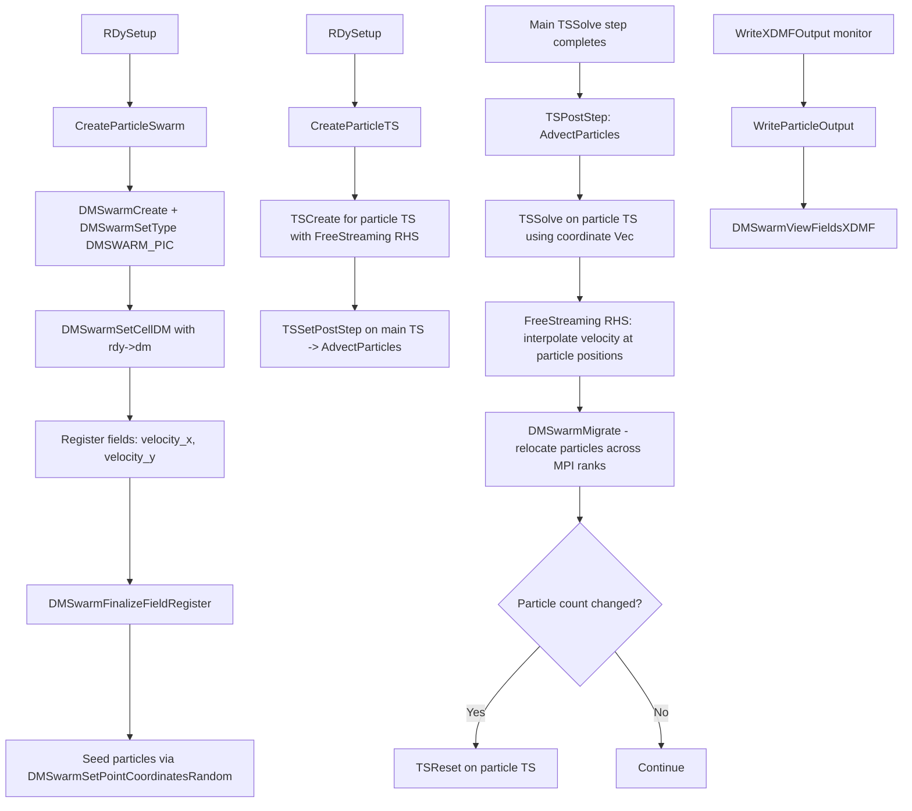

# Particle Tracers for RDycore — Incremental Development Plan

## Progress Tracker

| Phase | Task | Status | Verification Test | Test Status |
|-------|------|--------|-------------------|-------------|
| 1 | Create DMSwarm infrastructure — setup, fields, seeding | ✅ Complete | `TestParticleSwarmCreate`: seed particles, verify count and positions | ✅ Complete |
| 2 | Compute cell-center velocity from SWE solution and push particles | ✅ Complete | `TestParticleUniformFlow`: constant velocity field, verify analytical displacement | ✅ Complete |
| 3 | Parallel particle migration via `DMSwarmMigrate` | ✅ Complete | Integrated into `AdvectParticles` via `DMSwarmMigrate` + `TSReset` | ✅ Complete |
| 4 | Particle output — XDMF/HDF5 via `DMSwarmViewFieldsXDMF` | ✅ Complete | `WriteParticleOutput` called from `WriteXDMFOutput` each step | ✅ Complete |
| 5 | Full integration into RDycore main loop via `TSPostStep` | ✅ Complete | `AdvectParticles` registered via `TSSetPostStep` on main PDE TS | ✅ Complete |
| 6a | Vertex P1 projection for continuous velocity interpolation | ⬜ Future | TBD — compare trajectories with cell-constant baseline | ⬜ Future |
| 6b | Midpoint velocity averaging using cached `u_old` | ⬜ Future | TBD — verify second-order convergence rate | ⬜ Future |
| 6c | User-defined particle seeding locations | ⬜ Future | TBD — seed from file, verify positions | ⬜ Future |
| 6d | Pathline tracking with residence time | ⬜ Future | TBD — verify cumulative path length | ⬜ Future |

**Legend**: ⬜ Not Started · 🔨 In Progress · ✅ Complete · 🚫 Blocked

**Implementation Notes (2026-04-17)**:
- `DMSwarmPICField_cellid` does not exist in this PETSc version; use `DMSwarmGetCellDMActive` + `DMSwarmCellDMGetCellID` to get the cell ID field name string dynamically.
- `TSGetPreviousTime` → correct name is `TSGetPrevTime`.
- Build system is Ninja (`build.ninja`); PETSc at `/Users/markadams/Codes/petsc`, arch `arch-macosx-gnu-g`.
- All files compile cleanly with `-Wall -fsanitize=address,undefined -std=gnu11 -arch arm64`.

## Overview

Add Lagrangian particle tracers to RDycore as an **inline diagnostic**. Particles are advected during the simulation using the live SWE velocity field at each time step, but the particle advection does not feed back into the PDE solve. The implementation uses PETSc's `DMSwarm` with `DMSWARM_PIC` type for parallel particle management.

### Reference Implementation

The design follows the pattern established in PETSc's [`src/ts/tutorials/ex77.c`](../petsc_cld/src/ts/tutorials/ex77.c), which demonstrates:
- A **separate TS** for particle advection, with its own RHS function
- **`DMInterpolationInfo`** for interpolating the velocity field at particle positions
- **`DMSwarmCreateGlobalVectorFromField`** to wrap particle coordinates as a Vec for `TSSolve`
- **`DMSwarmMigrate`** after advection to relocate particles across MPI ranks
- **`TSReset`** when particle counts change after migration
- An **`AdvCtx`** that stores both initial and final velocity fields for time-centering

Our adaptation differs from ex77 in that:
- The velocity field comes from SWE conserved variables `h, hu, hv` at cell centers rather than an FEM velocity field
- Phase 1-5 uses cell-constant velocity lookup rather than `DMInterpolationInfo` — since RDycore uses FV with P0 cell-centered data, not FEM
- Phase 6 adds vertex P1 projection to enable proper `DMInterpolationInfo` interpolation

## Architecture



## Key Design Decisions

| Decision | Choice | Rationale |
|----------|--------|-----------|
| Particle type | `DMSWARM_PIC` | Provides cell-DM awareness, automatic point location, migration |
| Cell DM | `rdy->dm` the primary DMPlex | Already distributed, has overlap, defines spatial decomposition |
| Velocity source | Cell-center constant per cell | Simple; hu/h, hv/h from current solution. Phase 6 adds P1 vertex projection + `DMInterpolationInfo` |
| Particle advection | **Separate TS** for particles, following ex77.c pattern | Enables sub-stepping, different time integrators, clean separation of concerns |
| Time integration | Backward Euler style - use post-step velocity | Simple, no stability concerns for diagnostics. Phase 6 adds midpoint averaging via `AdvCtx.ui/uf` |
| Particle push trigger | `TSSetPostStep` on main TS → calls `TSSolve` on particle TS | Matches ex77.c pattern exactly; fires once per accepted PDE step |
| Coordinate Vec | `DMSwarmCreateGlobalVectorFromField` wrapping `DMSwarmPICField_coor` | Particle positions become the solution Vec for the particle TS, as in ex77.c |
| Migration | `DMSwarmMigrate` + `TSReset` if counts change | Handles particles crossing MPI boundaries; ex77.c pattern lines 860-868 |
| Output | Separate XDMF files via `DMSwarmViewFieldsXDMF` | PETSc provides this natively; keeps particle data separate from field data |
| Seeding | `DMSwarmSetPointCoordinatesRandom` with N per cell | Matches ex77.c `PART_LAYOUT_CELL` pattern; configurable via `-particles_per_cell` |

## Codebase Integration Points

### Files to Create
- [`src/rdyparticles.c`](src/rdyparticles.c) — All particle tracer logic
- [`include/private/rdyparticlesimpl.h`](include/private/rdyparticlesimpl.h) — Particle data structures and internal API

### Files to Modify
- [`include/private/rdycoreimpl.h`](include/private/rdycoreimpl.h) — Add `DM dm_swarm` and particle config to `struct _p_RDy`
- [`src/rdysetup.c`](src/rdysetup.c) — Call `CreateParticleSwarm` in `RDySetup`, register `TSPostStep`
- [`src/rdyadvance.c`](src/rdyadvance.c) — Call particle output in `WriteXDMFOutput` monitor
- [`src/rdycore.c`](src/rdycore.c) — Destroy particle swarm in `RDyDestroy`
- [`src/CMakeLists.txt`](src/CMakeLists.txt) — Add `rdyparticles.c` to build
- [`src/tests/CMakeLists.txt`](src/tests/CMakeLists.txt) — Add particle test executables

### Key Existing Code to Leverage
- [`OperatorRHSFunction`](src/rdysetup.c:1098) — Shows how `u_global` is scattered to `u_local` with ghost cells
- [`RDyAdvance`](src/rdyadvance.c:261) — Main time-stepping loop where `TSPostStep` callback fires
- [`WriteXDMFOutput`](src/xdmf_output.c:380) — Existing output monitor to extend for particle data
- [`CreateFlowDM`](src/rdydm.c:236) — Pattern for creating auxiliary DMs
- [`RiemannStateData`](src/swe/swe_types_petsc.h:14) — Shows h, hu, hv, u, v field structure

### Velocity Computation
The SWE solution vector `u_global` stores conserved variables per cell:
- Component 0: `h` — water height
- Component 1: `hu` — x-momentum
- Component 2: `hv` — y-momentum

Velocity is recovered as:
```c
// With tiny_h threshold from rdy->config.physics.flow.tiny_h
if (h > tiny_h) {
    vel_x = hu / h;
    vel_y = hv / h;
} else {
    vel_x = 0.0;
    vel_y = 0.0;
}
```

---

## Phase 1: DMSwarm Infrastructure

**Goal**: Create the particle swarm DM, register fields, seed particles. Follows the ex77.c pattern at lines 893-668.

### New Data Structures

```c
// in include/private/rdyparticlesimpl.h

// Advection context — mirrors ex77.c AdvCtx but adapted for SWE cell-center velocity
typedef struct {
    Vec       u_pde;             // pointer to the current PDE solution (rdy->u_global)
    PetscReal tiny_h;            // minimum water height threshold
    RDy       rdy;               // back-pointer to RDy for mesh/config access
} ParticleAdvCtx;

typedef struct {
    DM              dm_swarm;          // the DMSwarm
    TS              ts_particles;      // separate TS for particle advection (ex77.c pattern)
    ParticleAdvCtx  adv_ctx;           // advection context passed to FreeStreaming RHS
    PetscInt        particles_per_cell; // number of particles seeded per cell
    PetscBool       enabled;           // whether particle tracing is active
} RDyParticles;
```

### New Functions in `src/rdyparticles.c`

1. **`CreateParticleSwarm`** — Initialize DMSwarm (follows ex77.c lines 893-668)
   ```c
   // Create the swarm DM
   DMCreate(comm, &dm_swarm);
   PetscObjectSetOptionsPrefix((PetscObject)dm_swarm, "part_");  // ex77.c line 894
   DMSetType(dm_swarm, DMSWARM);
   DMSetDimension(dm_swarm, 2);  // 2D SWE
   DMSwarmSetCellDM(dm_swarm, rdy->dm);  // attach DMPlex as cell DM
   DMSwarmSetType(dm_swarm, DMSWARM_PIC);

   // Register custom fields for velocity storage
   DMSwarmRegisterPetscDatatypeField(dm_swarm, "velocity_x", 1, PETSC_REAL);
   DMSwarmRegisterPetscDatatypeField(dm_swarm, "velocity_y", 1, PETSC_REAL);
   DMSwarmFinalizeFieldRegister(dm_swarm);

   // Seed particles — ex77.c PART_LAYOUT_CELL pattern (lines 606-618)
   DMSwarmSetLocalSizes(dm_swarm, num_local_cells * Npc, 0);
   DMSwarmSetPointCoordinatesRandom(dm_swarm, Npc);

   // Define coordinate field as the Vec field for the particle TS
   DMSwarmVectorDefineField(dm_swarm, DMSwarmPICField_coor);  // ex77.c line 939
   ```

2. **`CreateParticleTS`** — Create separate TS for particle advection (follows ex77.c lines 921-938)
   ```c
   TSCreate(comm, &ts_particles);
   PetscObjectSetOptionsPrefix((PetscObject)ts_particles, "part_");
   TSSetDM(ts_particles, dm_swarm);
   TSSetProblemType(ts_particles, TS_NONLINEAR);
   TSSetExactFinalTime(ts_particles, TS_EXACTFINALTIME_MATCHSTEP);
   TSSetRHSFunction(ts_particles, NULL, FreeStreaming, &adv_ctx);
   TSSetFromOptions(ts_particles);

   // Attach particle TS to main TS via PetscObjectCompose (ex77.c line 938)
   PetscObjectCompose((PetscObject)rdy->ts, "_SwarmTS", (PetscObject)ts_particles);

   // Register AdvectParticles as PostStep on the main PDE TS (ex77.c line 937)
   TSSetPostStep(rdy->ts, AdvectParticles);
   ```

3. **`DestroyParticleSwarm`** — Clean up
   ```c
   TSDestroy(&rdy->particles.ts_particles);
   DMDestroy(&rdy->particles.dm_swarm);
   ```

### Integration
- Add `RDyParticles particles` field to `struct _p_RDy` in [`rdycoreimpl.h`](include/private/rdycoreimpl.h:114)
- Call `CreateParticleSwarm` + `CreateParticleTS` at end of [`RDySetup`](src/rdysetup.c:1351) after `InitSolver`
- Call `DestroyParticleSwarm` in `RDyDestroy`
- Enable via command-line option: `-particles_per_cell N` where N=0 means disabled

### Phase 1 Verification Test
**`test_particle_swarm_create`** — Unit test:
- Create a small DMPlex mesh from the existing `planar_dam_10x5.msh`
- Create a DMSwarm with 1 particle per cell
- Verify `DMSwarmGetLocalSize` returns expected count
- Verify particle coordinates via `DMSwarmGetField` for `DMSwarmPICField_coor` are within mesh bounds
- Verify `DMSwarmVectorDefineField` works and `DMCreateGlobalVector` returns correct-sized Vec
- Run on 1 and 2 MPI processes

---

## Phase 2: Velocity Computation and Particle Advection via Separate TS

**Goal**: Implement the `FreeStreaming` RHS and `AdvectParticles` PostStep following the ex77.c pattern.

### New Functions

3. **`FreeStreaming`** — RHS function for particle TS (follows ex77.c lines 428-479)
   
   This is the key function. For each particle, it computes the velocity at the particle position and returns it as the time derivative of position (dx/dt = v).

   ```c
   // Signature: PetscErrorCode FreeStreaming(TS ts, PetscReal t, Vec X, Vec F, void *ctx)
   // X = particle coordinates, F = velocity at particle positions
   
   // 1. Get the PDE solution and compute cell-center velocities
   //    vel_x[cell] = hu[cell] / h[cell], vel_y[cell] = hv[cell] / h[cell]
   //    with tiny_h guard
   
   // 2. Get particle cell IDs and coordinates
   DMSwarmGetField(sdm, DMSwarmPICField_cellid, ...)
   
   // 3. For each particle, look up its cell and assign velocity
   //    f[p*2 + 0] = vel_x[cell_id[p]]
   //    f[p*2 + 1] = vel_y[cell_id[p]]
   
   // 4. Also store velocity on particle fields for output
   DMSwarmGetField(sdm, "velocity_x", ...)
   ```

   **Note**: Unlike ex77.c which uses `DMInterpolationInfo` for FEM interpolation, we use direct cell-ID lookup since RDycore uses FV with cell-constant data. Phase 6 adds P1 projection + `DMInterpolationInfo`.

4. **`AdvectParticles`** — TSPostStep callback on main TS (follows ex77.c lines 834-871)
   ```c
   // 1. Retrieve the particle TS via PetscObjectQuery
   PetscObjectQuery((PetscObject)ts, "_SwarmTS", (PetscObject *)&sts);
   
   // 2. Wrap particle coordinates as a Vec
   DMSwarmCreateGlobalVectorFromField(sdm, DMSwarmPICField_coor, &coordinates);
   
   // 3. Set the particle TS max time to current PDE time
   TSGetTime(ts, &time);
   TSSetMaxTime(sts, time);
   
   // 4. Solve the particle ODE: dx/dt = v(x)
   TSSolve(sts, coordinates);
   
   // 5. Return the coordinate Vec to the swarm
   DMSwarmDestroyGlobalVectorFromField(sdm, DMSwarmPICField_coor, &coordinates);
   
   // 6. Migrate particles to correct MPI ranks (ex77.c line 860)
   DMSwarmMigrate(sdm, PETSC_TRUE);
   
   // 7. Reset particle TS if counts changed (ex77.c lines 863-868)
   DMSwarmGetSize(sdm, &newN);
   if (N != newN) {
       TSReset(sts);
       DMSwarmVectorDefineField(sdm, DMSwarmPICField_coor);
   }
   ```

### Integration
- `FreeStreaming` is set as the RHS of the particle TS in `CreateParticleTS`
- `AdvectParticles` is registered via `TSSetPostStep` on the main PDE TS
- The `ParticleAdvCtx` stores a pointer to `rdy->u_global` so `FreeStreaming` can access the current velocity

### Phase 2 Verification Test
**`test_particle_uniform_flow`** — Analytical verification:
- Set up a simple mesh with uniform initial conditions: `h=1.0`, `hu=1.0`, `hv=0.0` — giving `vel_x=1.0`, `vel_y=0.0`
- Seed 1 particle per cell
- Advance 10 PDE steps with `dt=0.1`
- Verify each particle has moved approximately `dx = 1.0` in x-direction, `dy = 0.0` in y-direction
- This confirms the `FreeStreaming` → `AdvectParticles` → `DMSwarmMigrate` pipeline works

---

## Phase 3: Parallel Particle Migration and Boundary Handling

**Goal**: Ensure particles correctly cross MPI partition boundaries and handle domain exit.

### Key Behavior (already in Phase 2 `AdvectParticles`)

The `DMSwarmMigrate(sdm, PETSC_TRUE)` call in `AdvectParticles` handles:
1. Determining which cell each particle now belongs to via the cell DM
2. Sending particles to the correct MPI rank if they crossed partition boundaries
3. Removing particles that left the domain (default behavior)

### Additional Work in Phase 3
- Add `TSReset` logic when particle counts change (ex77.c lines 863-868)
- Handle edge cases: particles at domain boundaries, dry cells with zero velocity
- Add logging: report particle counts per rank at each step when debug logging is enabled

### Boundary Particle Behavior
- Particles that exit the domain are removed by default via `DMSwarmMigrate`
- Particles in dry cells (h < tiny_h) get zero velocity and stay in place
- Start with simple removal at boundaries; add boundary-aware behavior later

### Phase 3 Verification Test
**`test_particle_migration`** — Multi-process test:
- Use `planar_dam_10x5.msh` on 2 MPI processes
- Set uniform flow `vel_x=1.0` pointing from left partition to right partition
- Seed particles near the partition boundary
- Advance several steps so particles cross the boundary
- Verify total particle count is conserved across all ranks via `MPI_Allreduce` (before any exit the domain)
- Continue advancing until some particles exit; verify count decreases correctly

---

## Phase 4: Particle Output

**Goal**: Write particle positions and velocities to XDMF/HDF5 files for visualization.

### New Functions

5. **`WriteParticleOutput`** — Write particle data
   - Use `DMSwarmViewFieldsXDMF` to write selected fields:
     - `DMSwarmPICField_coor` — particle coordinates (automatic)
     - `"velocity_x"`, `"velocity_y"` — particle velocities
   - Generate filename: `<prefix>-particles-<step>.xmf`
   - Called from the existing `WriteXDMFOutput` monitor at the same output interval
   - Also support `DMViewFromOptions` with `-part_dm_view` for debugging (ex77.c line 869)

### Integration
- Add call to `WriteParticleOutput` inside [`WriteXDMFOutput`](src/xdmf_output.c:380) when `rdy->particles.enabled`
- Particle XDMF files are written alongside field XDMF files in the same output directory

### Phase 4 Verification Test
**`test_particle_output`** — Output verification:
- Run a short simulation with particles enabled
- Verify `.xmf` particle files are created in the output directory
- Parse the XMF file to verify it references the correct HDF5 datasets
- Verify particle coordinate and velocity arrays have expected dimensions

---

## Phase 5: Full Integration and End-to-End Test

**Goal**: Complete integration into the RDycore main driver loop.

### Configuration
Add command-line options:
- `-particles_per_cell <N>` — number of particles per cell, 0 = disabled, default = 0
- `-part_ts_type <type>` — time integrator for particle TS, default = `euler`
- `-part_ts_max_steps <N>` — max sub-steps per PDE step for particle TS
- `-part_dm_view` — view particle DM for debugging (inherited from ex77.c options prefix)

### Integration Checklist
- `RDySetup` → `CreateParticleSwarm` + `CreateParticleTS` if enabled
- `InitSolver` → `TSSetPostStep(rdy->ts, AdvectParticles)`
- `WriteXDMFOutput` → call `WriteParticleOutput`
- `RDyDestroy` → `DestroyParticleSwarm`
- `PetscObjectCompose` to attach particle TS to main TS (ex77.c pattern)

### Phase 5 Verification Test
**`test_particle_dam_break`** — End-to-end with existing dam break case:
- Use the existing `DamBreak_grid5x10` test case
- Add `-particles_per_cell 1` to command line
- Run the simulation
- Verify particles move in the expected flow direction — away from the dam
- Verify particle output files are generated
- Visual inspection in VisIt/ParaView

---

## Phase 6 — Future Enhancements

### 6a: Vertex P1 Projection for Continuous Velocity + DMInterpolationInfo

**Goal**: Replace cell-constant velocity lookup with proper FE interpolation, matching the ex77.c `DMInterpolationInfo` approach.

- Create a vertex-based DM with P1 FE section for velocity — 2 components: vel_x, vel_y
- Project cell-center velocities to vertices via L2 projection or area-weighted averaging
- In `FreeStreaming`, replace cell-ID lookup with:
  ```c
  // ex77.c pattern lines 457-468
  DMInterpolationCreate(PETSC_COMM_SELF, &ictx);
  DMInterpolationSetDim(ictx, dim);
  DMInterpolationSetDof(ictx, dim);
  DMInterpolationAddPoints(ictx, Np, coords);
  DMInterpolationSetUp(ictx, vel_dm, PETSC_FALSE, PETSC_TRUE);
  DMInterpolationEvaluate(ictx, vel_dm, locvel, pvel);
  DMInterpolationDestroy(&ictx);
  ```
- This gives continuous velocity across cell boundaries and more accurate trajectories

### 6b: Midpoint Velocity Averaging

**Goal**: Second-order accurate particle trajectories, following ex77.c `AdvCtx.ui/uf` pattern.

- Add `Vec u_old` to `ParticleAdvCtx` (mirrors ex77.c `AdvCtx.ui`)
- Before `TSSolve` on main TS, cache: `VecCopy(rdy->u_global, adv_ctx.u_old)`
- In `FreeStreaming`, compute: `v_mid = 0.5 * (v(u_old) + v(u_new))`
- Or use Crank-Nicholson as suggested in ex77.c comment at line 426
- Storage cost: one extra global Vec

### 6c: User-Defined Particle Seeding

- Allow seeding particles at specific x,y coordinates from a file
- Use `DMSwarmSetPointCoordinates` with `redundant=PETSC_TRUE`
- Support box layout like ex77.c `PART_LAYOUT_BOX` (lines 620-661)
- Support adding particles at runtime via the coupling API

### 6d: Particle Pathline Tracking

- Store cumulative path length and travel time on each particle
- Register additional fields: `"path_length"`, `"travel_time"`, `"origin_x"`, `"origin_y"`
- Enables residence time analysis and pathline visualization

---

## File Summary

| File | Action | Description |
|------|--------|-------------|
| `include/private/rdyparticlesimpl.h` | **Create** | Particle data structures and internal API |
| `src/rdyparticles.c` | **Create** | All particle tracer logic |
| `src/tests/test_particle_swarm.c` | **Create** | Unit and integration tests |
| `include/private/rdycoreimpl.h` | Modify | Add `RDyParticles` to `struct _p_RDy` |
| `src/rdysetup.c` | Modify | Call `CreateParticleSwarm`, register `TSPostStep` |
| `src/rdyadvance.c` | Modify | Minor — ensure PostStep fires |
| `src/xdmf_output.c` | Modify | Call `WriteParticleOutput` |
| `src/rdycore.c` | Modify | Destroy particle swarm |
| `src/CMakeLists.txt` | Modify | Add `rdyparticles.c` |
| `src/tests/CMakeLists.txt` | Modify | Add test executables |

## Test Run Information

From the RAG system, the existing Houston1km test case can be run as:
```bash
cd driver/tests/swe_roe
../../../bin/rdycore Houston1km.DirichletBC.yaml \
  -homogeneous_rain_file Houston1km.rain.int32.bin \
  -homogeneous_bc_file Houston1km.bc.int32.bin \
  -temporally_interpolate_bc \
  -particles_per_cell 1
```

Output visualization:
```bash
cd output
ls -1 Houston1km.DirichletBC.*.xmf | sort > Houston1km.visit
# Particle files will be: Houston1km.DirichletBC-particles-*.xmf
```
